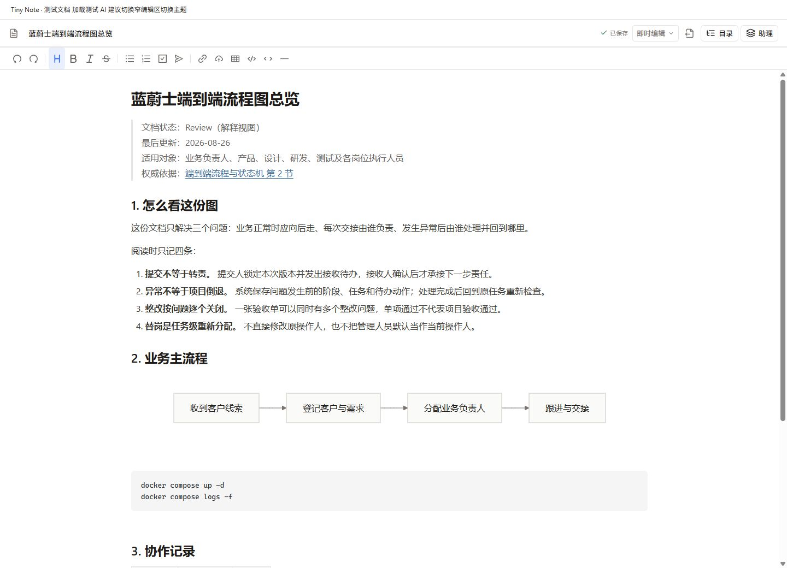
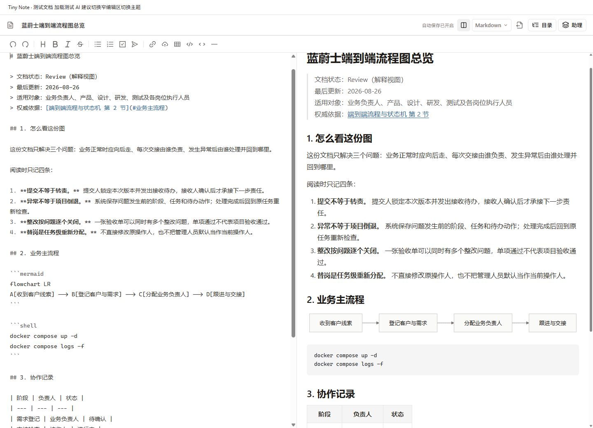
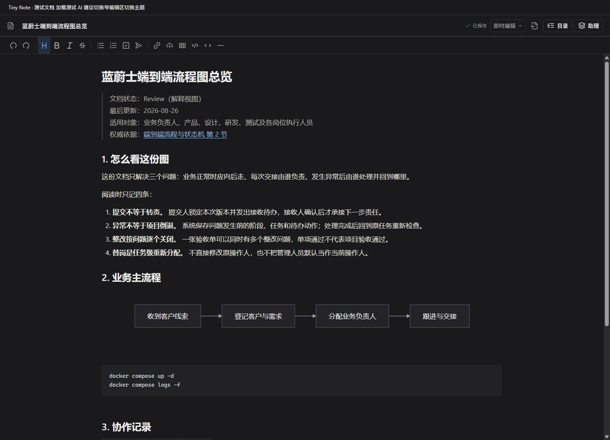
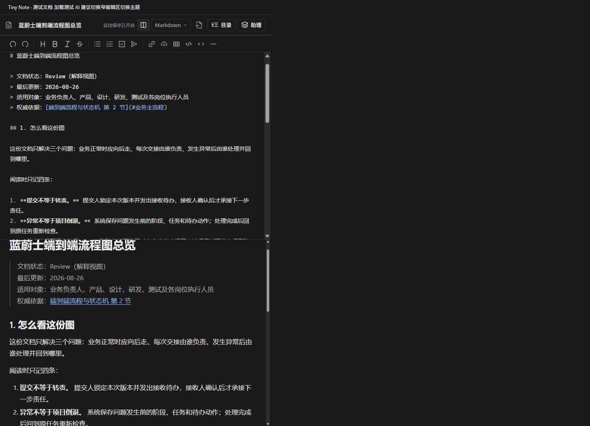
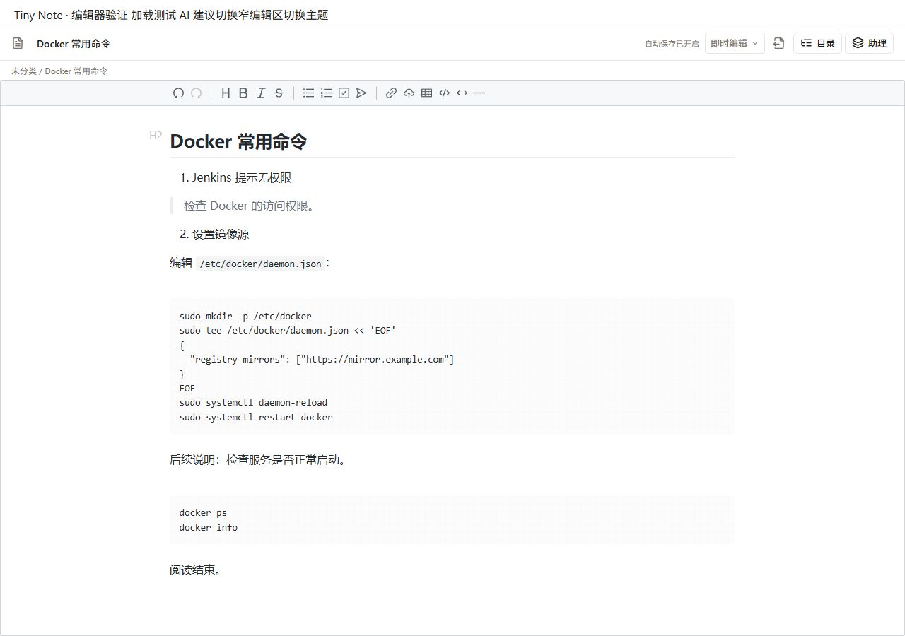
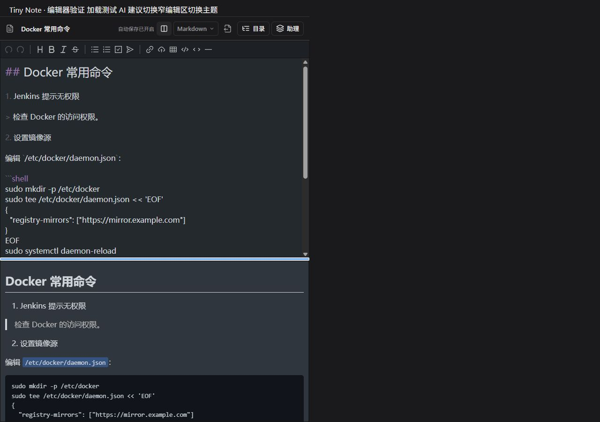
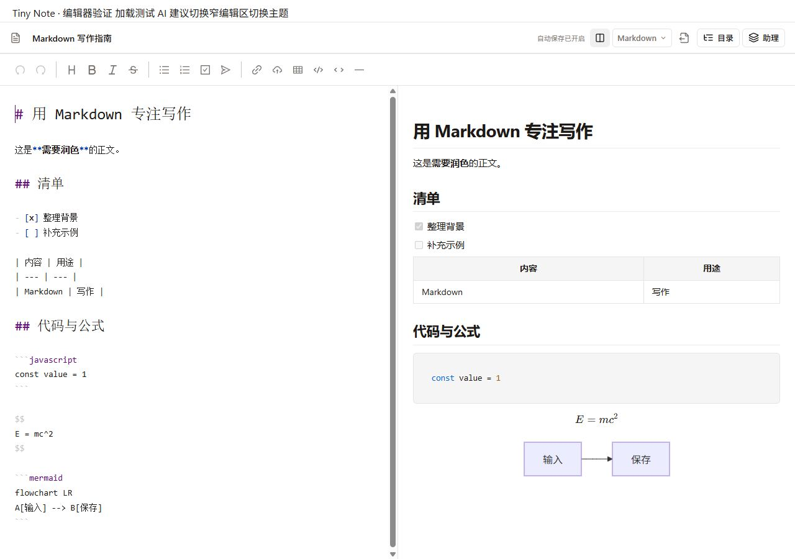
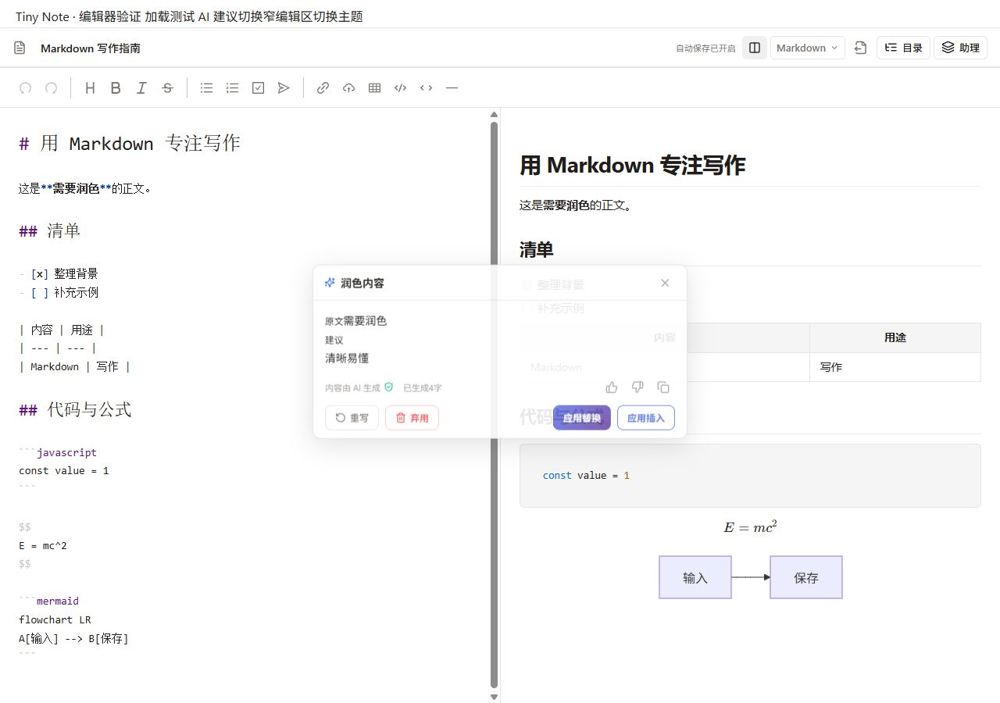
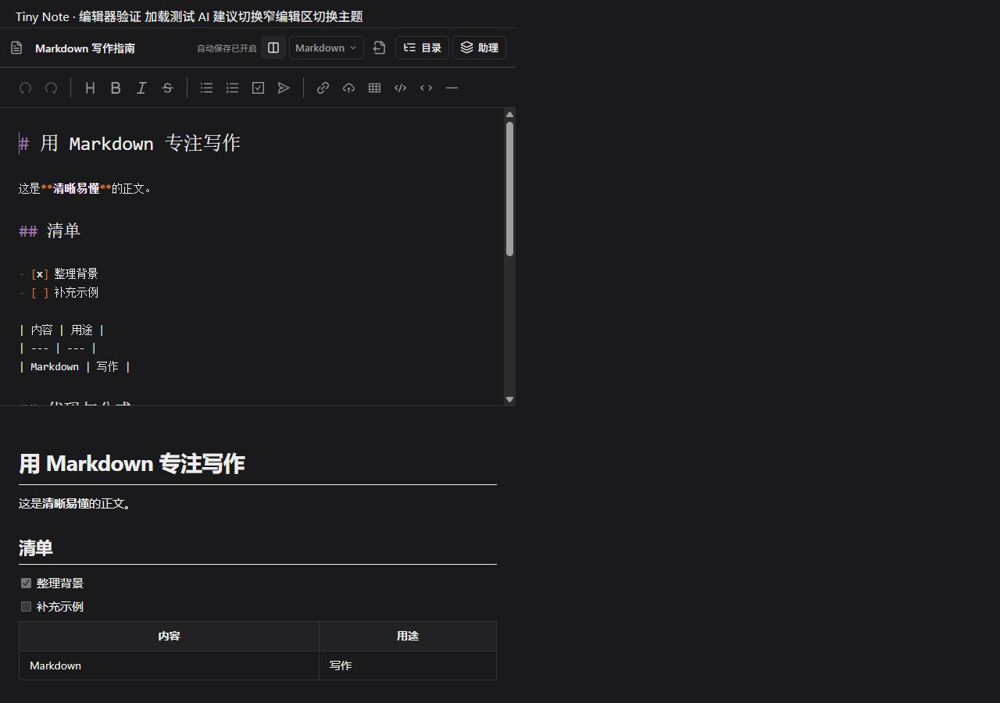

# Vditor 编辑器验证

状态：Review  
最后更新：2026-09-30  
关联：[集成设计](../03-architecture/vditor-editor.md)、[编辑体验](../01-requirements/editor-modes.md)、[验收标准](../01-requirements/acceptance/mvp.md)

## 自动验证

测试使用真实 Vditor 与真实 Lute；jsdom 仅替换本地脚本加载和浏览器缺失的编辑原语。实际键盘输入另外通过浏览器验证。覆盖两个模式、Markdown 保真切换、自动保存/切换文章、独立名称、旧 HTML、表格/公式/Front matter/脚注/Mermaid、图片插入、导出与阅读位置。

AI 覆盖选区映射、重复文字、Markdown 格式保留、替换/插入、过期建议、失败回滚、空保存响应、请求/响应晚于文章切换、上下文授权、外部来源限制、自定义指令、助理和两模式 FIM Tab 接受。

项目完整检查命令：`npm run check`（lint、TypeScript、单元测试、CommandMap、组件大小、样式隔离、生产构建及启动包预算）。2026-09-30 最终执行退出码为 0：

- 单元测试：113 个文件、538 项通过（含应用主题隔离及图表主题刷新回归）。
- ESLint、应用/测试/Node TypeScript 检查全部通过。
- CommandMap：134 条命令通过（120 remote、14 Tauri 平台）。
- 组件大小、6 个懒加载样式包隔离检查通过。
- 生产构建通过；启动 JS 178,053 B / 500,000 B，CSS 74,118 B / 100,000 B。
- `git diff --check` 通过。

ESLint 排除构建生成的第三方 vendor 资源、临时验证页和 Vite 时间戳配置文件，避免把上游 MathJax 数据文件当项目 JavaScript 解析；项目源码规则没有放宽。

## 浏览器验证

### 当前应用主题验证（2026-09-30）

用户确认效果图方向后，实际浏览器在 1440×1040 下验证中文长文、代码、Mermaid、引用、列表、表格与复选框；即时编辑正文为 16px/28px 行高，H1–H3 为 28/23/19px，工具栏左内边距 16px。旧排版类未恢复，非聚焦代码源码保持折叠，代码背景纹理移除。

Markdown 源码标题为 14px，源文和预览分栏正常；660px 窄区的 clientWidth/scrollWidth 同为 660px，分隔条改为 horizontal。明暗主题切换重绘 Mermaid，检查可编辑围栏中的源码仍完整且没有 SVG；连续主题/模式切换后原文标题仅一份。

测试 AI 提案应用后“需要润色”替换为“清晰易懂”，其余长文及图表源码保留，实际保存状态为“已保存”；没有真实模型请求。浏览器控制台无 warning/error。完整 `npm run check` 退出码 0。以下截图来自真实组件的隔离验证页，不是生成效果图；桌面 WebView2 安装包未另行验证。

### 迁移及临时原生样式历史验证

使用 `--mode test` 的隔离示例页挂载实际 `NoteEditor`、Pinia、主题样式和 Vditor，使用本机测试数据与现有浏览器后端。没有调用真实模型、修改真实笔记或请求生产数据。

- 桌面 1280×900：原生源码选区替换输入、实时预览、Ctrl+Z 撤销正常；表格、任务列表、代码高亮、KaTeX 和 Mermaid 正常呈现。
- AI：读取测试提案展示前后对照，应用替换后仅“需要润色”变成“清晰易懂”，周围粗体标记、标题与其他正文保持；结果关闭并显示真实“已保存”状态。
- 编辑区 660px：源码/预览改为上下布局，分隔条为 horizontal，编辑区 scrollWidth 与宽度均为 660px，无横向溢出。深色主题可用。
- 分栏键盘 Right 将比例从 50 调至 55；单元测试另外验证拖动上下限与双向滚动。
- 独立测试页复制当前 Tauri CSP：本地 Lute/语言/图标、KaTeX、Mermaid 及 AI 应用正常，浏览器控制台未报告 warning/error。

### 原生样式修订（2026-09-30）

用户指出迁移初版阅读不适后，移除 `note-prose` / `editor-content` 继承及自定义 Vditor 排版覆盖。新增回归先在旧实现下复现 15px 字号，修复后真实编辑实例在旧样式同时加载时保持原生 16px / 1.5 行高及代码间距，Markdown 预览同样通过。jsdom 不支持的样式分组仅在该测试中展开，真实层叠另由浏览器检查。

浏览器重新验证 1280×900 即时编辑、Markdown 分屏、660px 窄区、原生明暗主题；非聚焦代码源码高度为 0，预览只显示一份。窄区宽度与 scrollWidth 均为 660px，分隔条水平，键盘 Right 将比例从 50 调至 55。控制台无 warning/error。保留原生 IR 代码编辑行为，不将聚焦代码块的源码与预览视为数据重复。

以下为当前原生样式截图：

### 迁移初版功能验证截图（样式已被上方修订替代）

后续预览反馈已移除编辑区路径行（“未分类 / 文章标题”），上方原生样式截图保留为此前验证记录。对应布局测试改为验证路径行不存在、独立名称与真实保存状态仍保留；本次布局、标题栏及样式隔离共 13 项测试通过。

## 审查与限制

修复了外部整篇提案覆盖未保存草稿、等待保存期间跨文章发起 AI、空应用响应误判成功、原生重复 selectionchange 清除 FIM、目录依赖旧编辑器 DOM 和图标资源卸载重建问题。派生 HTML 保持净化；Mermaid 强制 strict；阻断上游 PlantUML 自动远程渲染。

未运行真实模型付费请求、生产 Go API 联调或 Tauri 安装包端到端测试。本次没有修改 Rust/Go；桌面 CSP 的浏览器验证不能替代 WebView2 安装包实测。Vite 的大型懒加载图表/PDF chunk 提示仍存在，启动包预算单独校验。旧编辑器文件与历史测试保留，但不再进入文章编辑运行路径。
