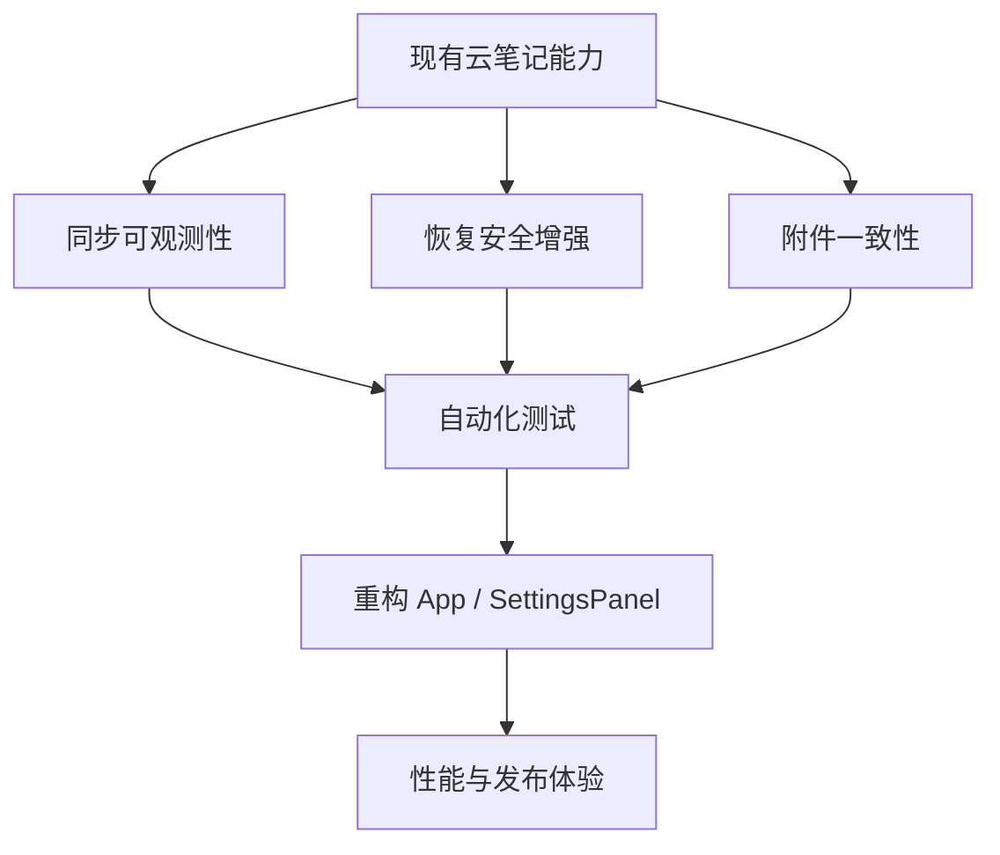

# Kova 下一阶段优化规划

## 0. 当前判断

当前云笔记主链路已经具备：本地离线优先、增量同步、冲突处理、附件同步、云备份恢复、设备管理、首次同步入口。

下一阶段不建议先做大功能。更值得优先做的是：

- 同步链路可诊断：失败后能知道卡在哪里。
- 恢复链路更安全：大文件校验、附件目录替换、回滚边界更清晰。
- 附件链路更一致：重复下载、重复上传、清理误判要减少。
- UI 模块降复杂度：`SettingsPanel` 和 `App` 已经承担过多职责。
- 构建与测试基线：避免后续每次改同步都靠手测。

## P0：同步可观测性与问题定位

目标：同步失败时能快速判断是本地队列、网络、云端冲突、附件、备份还是认证问题。

涉及文件：

- `[D:\study\kova\src\lib\sync.ts](D:\study\kova\src\lib\sync.ts)`
- `[D:\study\kova\src\lib\db.ts](D:\study\kova\src\lib\db.ts)`
- `[D:\study\kova\src-tauri\src\services\db\sync.rs](D:\study\kova\src-tauri\src\services\db\sync.rs)`
- `[D:\study\kova\src\components\StatusBar.tsx](D:\study\kova\src\components\StatusBar.tsx)`
- `[D:\study\kova\src\components\layout\SettingsPanel\index.tsx](D:\study\kova\src\components\layout\SettingsPanel\index.tsx)`

改动方向：

- 增加本地同步诊断面板：待同步、失败、冲突、最近错误、最近一次 push/pull 游标。
- 给每次同步生成 `runId`，串联 push、pull、附件下载、ack、失败记录。
- 将 `CloudSyncResult` 扩展为更细粒度统计：notes/folders/attachments/settings pushed/pulled/skipped/conflict。
- 增加“复制诊断信息”入口，便于用户反馈问题。

验证：

- 断网、登录失效、服务端 500、附件下载失败、本地 pending 冲突都能在 UI 看到不同状态。
- `npm run build`、`cargo check` 通过。

## P1：恢复与备份安全增强

目标：恢复链路从“可回滚”升级为“可预检、可解释、低内存”。

涉及文件：

- `[D:\study\kova\src-tauri\src\lib.rs](D:\study\kova\src-tauri\src\lib.rs)`
- `[D:\study\kova\src-tauri\src\services\db\mod.rs](D:\study\kova\src-tauri\src\services\db\mod.rs)`
- `[D:\study\kova\src\components\layout\SettingsPanel\index.tsx](D:\study\kova\src\components\layout\SettingsPanel\index.tsx)`
- `[D:\study\kova\src\lib\cloudApi.ts](D:\study\kova\src\lib\cloudApi.ts)`

改动方向：

- 文件大小和 SHA-256 计算下沉到 Rust，避免前端一次性读大 ZIP。
- 恢复前增加预检结果：数据库存在、manifest 合法、附件目录完整、版本兼容。
- ZIP 恢复使用临时目录完整解包校验，再替换数据库与附件目录。
- 快照列表增加“恢复前预览”：设备、创建时间、笔记数、附件数、hash、大小、状态。

验证：

- 大备份包不会造成前端内存明显飙升。
- 损坏 ZIP、缺少 `kova.db`、manifest 不合法会在替换前拒绝。
- 恢复失败后旧数据和附件仍保留。

## P2：附件一致性与清理优化

目标：附件不重复上传、不重复下载，清理前可预览，远端/本地引用一致。

涉及文件：

- `[D:\study\kova\src\lib\assetArchive.ts](D:\study\kova\src\lib\assetArchive.ts)`
- `[D:\study\kova\src\lib\sync.ts](D:\study\kova\src\lib\sync.ts)`
- `[D:\study\kova\src-tauri\src\services\db\sync.rs](D:\study\kova\src-tauri\src\services\db\sync.rs)`
- `[D:\study\kova\src-tauri\src\lib.rs](D:\study\kova\src-tauri\src\lib.rs)`
- `[D:\study\kova\src\components\layout\SettingsPanel\index.tsx](D:\study\kova\src\components\layout\SettingsPanel\index.tsx)`

改动方向：

- 附件索引增加按 `sha256 + fileSize` 的复用策略。
- 缺失附件下载前先检查是否已有同 hash 本地文件。
- 孤儿附件清理拆成两步：仅统计/预览、确认删除。
- 同步结果展示附件上传、下载、跳过、失败数量。

验证：

- 同一张图片多篇笔记引用时不重复上传。
- 云端拉取同一附件时优先复用本地文件。
- 清理前能看到将删除数量和体积。

## P3：UI 职责拆分

目标：降低 `App.tsx` 和 `SettingsPanel/index.tsx` 复杂度，后续维护更稳。

涉及文件：

- `[D:\study\kova\src\App.tsx](D:\study\kova\src\App.tsx)`
- `[D:\study\kova\src\components\layout\SettingsPanel\index.tsx](D:\study\kova\src\components\layout\SettingsPanel\index.tsx)`
- `[D:\study\kova\src\components\layout\LoginPanel.tsx](D:\study\kova\src\components\layout\LoginPanel.tsx)`
- `[D:\study\kova\src\hooks\useNotes.ts](D:\study\kova\src\hooks\useNotes.ts)`

改动方向：

- 从 `App.tsx` 抽出 `useCloudSyncController`：同步、自动同步、状态刷新、冲突刷新。
- 从 `SettingsPanel` 拆出：数据存储、备份恢复、云端设备、外观编辑器设置四个子块。
- 首次同步向导从 `LoginPanel` 中独立成小组件，减少登录面板职责。

验证：

- 拆分后行为不变。
- `npm run build` 通过。
- 新模块只承载单一职责，状态流向更清楚。

## P4：自动化测试与回归基线

目标：同步、恢复、冲突、附件这些高风险链路不再只靠手测。

涉及文件：

- `[D:\study\kova\package.json](D:\study\kova\package.json)`
- `[D:\study\kova\src\lib\sync.ts](D:\study\kova\src\lib\sync.ts)`
- `[D:\study\kova\src-tauri\src\services\db\sync.rs](D:\study\kova\src-tauri\src\services\db\sync.rs)`
- `D:\study\tiny_rbac\src\main\java\com\ynx\hiro\modules\kova\sync\service\impl\KovaSyncServiceImpl.java`

改动方向：

- 前端增加基础测试工具，优先覆盖纯数据转换：payload 归一化、settings 收集、附件映射、同步结果统计。
- Rust 增加同步队列压缩、pending 保护、附件索引的单元测试。
- 后端增加版本递增、冲突判断、快照登记校验的服务层测试。
- 增加一份手动回归清单：断网编辑、双端冲突、附件缺失、恢复失败、设备撤销。

验证：

- 前端测试命令、Rust 测试命令、后端测试命令可独立运行。
- 至少覆盖同步核心数据分支，而不是只测 UI 渲染。

## P5：性能与发布体验

目标：降低大笔记、大附件、多设备同步时的卡顿和包体风险。

涉及文件：

- `[D:\study\kova\vite.config.ts](D:\study\kova\vite.config.ts)`
- `[D:\study\kova\src\components\detail\NoteDetail.tsx](D:\study\kova\src\components\detail\NoteDetail.tsx)`
- `[D:\study\kova\src\components\shared\MarkdownPreview.tsx](D:\study\kova\src\components\shared\MarkdownPreview.tsx)`
- `[D:\study\kova\src\components\layout\AIChatPanel\index.tsx](D:\study\kova\src\components\layout\AIChatPanel\index.tsx)`

改动方向：

- 大模块动态加载：AI 面板、冲突弹窗、云备份列表。
- Markdown 预览防抖或按需渲染，减少大文档编辑卡顿。
- 图片预览资源释放与懒加载。
- 构建包体分析，处理当前主包过大的 warning。

验证：

- `npm run build` 仍通过。
- 主窗口首屏 bundle 降低。
- 大文档编辑输入延迟下降。

## 建议执行顺序

1. 先做 P0 同步可观测性。
2. 再做 P1 恢复安全增强。
3. 接着做 P2 附件一致性。
4. 然后做 P3 UI 拆分。
5. 最后补 P4 测试基线和 P5 性能发布体验。

原因：当前最有价值的是“出问题能定位、恢复更安全、附件不乱”，这些比继续扩功能更能降低后续维护成本。