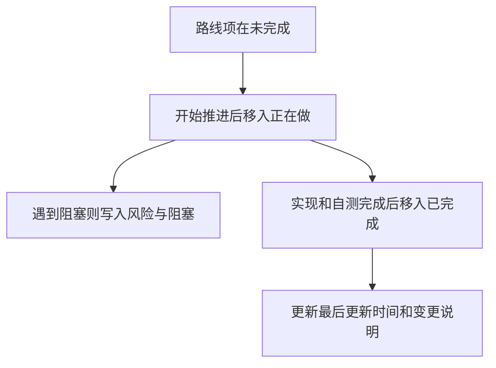

# Kova 下一阶段计划文件维护方案

## 目标

把这次路线图落成一份长期维护的计划文档，放在 `docs` 下，后续每推进一项都只更新这一个主文件，不再靠聊天记录追状态。

## 计划文件位置

建议建立 1 个主文件：
- [D:\study\kova\docs\plans\2026-06-11-kova-next-stage-plan.md](D:\study\kova\docs\plans\2026-06-11-kova-next-stage-plan.md)

如果你不想新建 `plans` 子目录，也可以退一步放到：
- [D:\study\kova\docs\2026-06-11-kova-next-stage-plan.md](D:\study\kova\docs\2026-06-11-kova-next-stage-plan.md)

我的建议是优先用 `docs/plans/`，因为后面还会继续有别的迭代计划、设计稿和回顾。

## 这份计划文件应该承担什么职责

这不是一份“静态路线图”，而是一份“持续维护中的执行面板”。

它需要同时承担 4 个作用：
- 记录这次要做什么
- 标记哪些已经完成
- 标记哪些正在做
- 标记哪些还没开始，以及为什么还没开始

## 建议文档结构

文档建议固定成下面 7 段，后续只更新内容，不改骨架。

### 1. 文档头部

写清楚这份文件的作用域：
- 目标版本或目标阶段
- 当前维护人
- 最近更新时间
- 当前总体状态

建议头部字段：
- `范围`：Kova 下一阶段体验完善
- `当前主线`：产品体验优先
- `当前状态`：规划中 / 执行中 / 阻塞中 / 已完成
- `最后更新`：日期

### 2. 已完成

只放已经真正收口的事项。

进入这个区的标准：
- 功能已落地
- 相关链路已自测
- 没有明显待补尾项

建议格式：
- 项目名
- 完成日期
- 影响范围
- 结果说明

### 3. 正在做

这是最重要的区块，必须始终只有少量条目，避免“什么都在做”。

进入这个区的标准：
- 已经开始实现或已经开始拆解
- 本轮明确要推进
- 有清晰的下一步动作

建议每条都写：
- 当前目标
- 涉及模块
- 下一步
- 风险/阻塞

### 4. 未完成

这里放确定要做，但还没进入执行的项。

建议按优先级拆成：
- P0：近期必须推进
- P1：下一轮推进
- P2：暂缓但保留

### 5. 当前迭代范围

每次只维护当前 1~2 个迭代，不把所有路线一次铺平。

比如：
- 迭代一：主界面高频体验收口
- 迭代二：编辑器和同步信任感

这个区块的作用是避免“总路线图很大，但本周到底做什么不清楚”。

### 6. 风险与阻塞

专门记录为什么某些事情不能动，或者暂时不该动。

建议记录：
- 是否依赖 `App.tsx` 状态拆分
- 是否依赖同步链路先稳定
- 是否需要先补测试再改
- 是否和 AI 面板、快捷便签有联动影响

### 7. 更新规则

这部分写在文档底部，后续按规则维护。

建议规则：
- 每次开始做一项时，从“未完成”移动到“正在做”
- 每次确认收口后，从“正在做”移动到“已完成”
- 每次范围变化，要补一条“变更说明”
- 不允许同时挂太多“正在做”项目

## 基于当前路线图的初始状态建议

### 已完成

当前这次规划里，真正已经完成的只有“方向确定”和“路线拆分”。

建议先放进去的已完成项：
- 已确定主线为“产品体验优先”
- 已完成下一阶段模块扫描
- 已完成分阶段路线图拆解

### 正在做

如果从现在开始维护，我建议“正在做”先只保留 1 项：
- 主界面高频体验收口方案细化

原因是你目前还在计划收束阶段，不适合一上来把四个主线都标成进行中。

### 未完成

先把下面这些放入未完成：
- 统一保存状态语言
- 梳理列表选择态与编辑态
- 补搜索结果反馈与排序入口
- 主界面同步状态可见
- 草稿保护
- 附件插入结果统一
- 冲突提示入口前置
- 同步诊断人话化
- 高风险链路最小回归验证
- `App.tsx` 编排压力拆解

## 与代码结构的对应关系

这份计划文档后续维护时，建议始终带上模块映射，避免任务悬空。

当前主要映射关系：
- 主容器编排在 [D:\study\kova\src\App.tsx](D:\study\kova\src\App.tsx)
- 笔记状态流在 [D:\study\kova\src\hooks\useNotes.ts](D:\study\kova\src\hooks\useNotes.ts)
- 编辑保存体验在 [D:\study\kova\src\components\detail\NoteDetail.tsx](D:\study\kova\src\components\detail\NoteDetail.tsx)
- 列表与多选交互在 [D:\study\kova\src\components\shared\NoteList.tsx](D:\study\kova\src\components\shared\NoteList.tsx)
- 搜索入口在 [D:\study\kova\src\components\shared\SearchBar.tsx](D:\study\kova\src\components\shared\SearchBar.tsx)
- 同步状态与诊断在 [D:\study\kova\src\lib\sync.ts](D:\study\kova\src\lib\sync.ts)
- 同步持久化在 [D:\study\kova\src-tauri\src\services\db\sync.rs](D:\study\kova\src-tauri\src\services\db\sync.rs)

## 推荐维护节奏

## 当前建议的维护方式

从现在开始，这份文档就按下面的方式使用：
- 只保留 1~3 条“正在做”
- 每完成一个点就移动区块，不重复写两遍
- 每条事项都附带影响文件或模块
- 计划变化时只改这一个主文件

## 本次确认后要做的事

你确认这个方案后，下一步就不是继续讨论路线，而是直接在 `docs` 下创建这份计划文件，并把当前状态初始化进去。

初始化完成后，文档里应该立刻能看到三类状态：
- 已完成
- 正在做
- 未完成

这样后面你再让我继续推进，我就能直接维护这一个文件，不会丢状态。