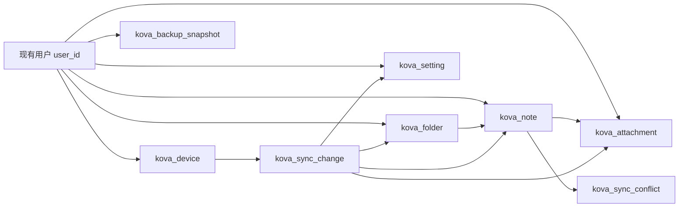

# Kova 云同步业务表规划

## 1. 本次范围

只处理后端业务表，路径为 [`D:\study\tiny_rbac`](D:\study\tiny_rbac)。

明确不做：

- 不修改授权、登录、角色、菜单、客户端体系。
- 不改 [`D:\study\tiny_rbac\src\main\java\com\ynx\hiro\modules\system\auth`](D:\study\tiny_rbac\src\main\java\com\ynx\hiro\modules\system\auth)。
- 不改 [`D:\study\tiny_rbac\src\main\java\com\ynx\hiro\config\auth`](D:\study\tiny_rbac\src\main\java\com\ynx\hiro\config\auth)。
- 不新增 `sys_menu`、`sys_role`、`sys_user`、`sys_client` 相关数据。
- 不做前端同步页、不做 Kova 本地 SQLite 改造。

本次只新增 Kova 云同步业务数据承载能力。

## 2. 后端现状判断

`tiny_rbac` 当前适合直接新增独立业务域：

- Liquibase 主入口在 [`D:\study\tiny_rbac\src\main\resources\db\changelog\db.changelog-master.xml`](D:\study\tiny_rbac\src\main\resources\db\changelog\db.changelog-master.xml)。
- 增量 SQL 按版本目录放在 [`D:\study\tiny_rbac\src\main\resources\db\changelog`](D:\study\tiny_rbac\src\main\resources\db\changelog)。
- 通用审计字段来自 [`D:\study\tiny_rbac\src\main\java\com\ynx\hiro\common\domain\entity\BaseEntity.java`](D:\study\tiny_rbac\src\main\java\com\ynx\hiro\common\domain\entity\BaseEntity.java)，对应：`create_by`、`create_time`、`update_by`、`update_time`、`del_flag`。
- 逻辑删除规则在 [`D:\study\tiny_rbac\src\main\resources\common-mybatis.yml`](D:\study\tiny_rbac\src\main\resources\common-mybatis.yml)，`0` 未删除，`1` 已删除。
- 业务模块分层可参考 [`D:\study\tiny_rbac\src\main\java\com\ynx\hiro\modules\drive`](D:\study\tiny_rbac\src\main\java\com\ynx\hiro\modules\drive)。

## 3. 模块边界

建议新增独立模块：

- [`D:\study\tiny_rbac\src\main\java\com\ynx\hiro\modules\kova`](D:\study\tiny_rbac\src\main\java\com\ynx\hiro\modules\kova)

后续如需要 Java 代码，保持现有分层：

```text
modules/kova/sync/
├── controller
├── service
├── service/impl
├── mapper
└── domain
    ├── entity
    ├── dto
    ├── vo
    └── enums
```

但本次“只需要业务表”时，可以只落 SQL 迁移，Java 分层后置。

## 4. 推荐业务表

### 4.1 `kova_device`

用途：记录用户的 Kova 设备，不承担登录授权，只作为同步业务设备。

核心字段：

- `id`：后端主键。
- `user_id`：归属用户 ID，来自现有登录用户。
- `device_id`：Kova 客户端生成的稳定设备 ID。
- `device_name`：设备名。
- `platform`：Windows / macOS / Linux 等。
- `app_version`：客户端版本。
- `last_sync_time`：最近同步时间。
- `last_push_version`：最近推送版本。
- `last_pull_cursor`：最近拉取游标。
- 通用字段：`create_by`、`create_time`、`update_by`、`update_time`、`del_flag`。

关键索引：

- `uk_user_device`: `user_id + device_id`
- `idx_user_last_sync`: `user_id + last_sync_time`

### 4.2 `kova_folder`

用途：承载云端文件夹树。

核心字段：

- `id`：后端主键。
- `user_id`：归属用户。
- `cloud_id`：云端对象 ID，给客户端稳定引用。
- `client_id`：本地 Kova SQLite 中的 folder `id`。
- `parent_cloud_id`：父文件夹云 ID。
- `parent_client_id`：父文件夹客户端 ID，便于首次同步和兼容本地结构。
- `name`：文件夹名。
- `sync_version`：云端版本号。
- `source_device_id`：最后一次修改来源设备。
- `client_created_at`：客户端创建时间。
- `client_updated_at`：客户端更新时间。
- `deleted_at`：业务软删除时间，用于同步删除。
- 通用字段。

关键索引：

- `uk_user_cloud`: `user_id + cloud_id`
- `uk_user_client`: `user_id + client_id`
- `idx_user_parent`: `user_id + parent_cloud_id`
- `idx_user_version`: `user_id + sync_version`

### 4.3 `kova_note`

用途：承载云端笔记主体。

核心字段：

- `id`：后端主键。
- `user_id`：归属用户。
- `cloud_id`：云端对象 ID。
- `client_id`：本地 Kova SQLite 中的 note `id`。
- `folder_cloud_id`：所属文件夹云 ID。
- `folder_client_id`：所属文件夹客户端 ID。
- `title`：标题。
- `content`：Markdown 正文。
- `tags`：JSON 字符串。
- `note_type`：预留，兼容本地 `note_type`。
- `done`：预留，兼容待办。
- `due_date`：预留，兼容日期。
- `sync_version`：云端版本号。
- `content_hash`：正文 hash，用于冲突判断。
- `source_device_id`：最后一次修改来源设备。
- `client_created_at`：客户端创建时间。
- `client_updated_at`：客户端更新时间。
- `deleted_at`：业务软删除时间。
- 通用字段。

关键索引：

- `uk_user_cloud`: `user_id + cloud_id`
- `uk_user_client`: `user_id + client_id`
- `idx_user_folder`: `user_id + folder_cloud_id`
- `idx_user_version`: `user_id + sync_version`
- `idx_user_deleted`: `user_id + deleted_at`

### 4.4 `kova_attachment`

用途：承载 Kova 笔记附件元数据。文件实体可以复用现有文件存储能力，不改 `system/file` 表结构。

核心字段：

- `id`：后端主键。
- `user_id`：归属用户。
- `cloud_id`：附件云 ID。
- `note_cloud_id`：所属笔记云 ID。
- `note_client_id`：所属笔记客户端 ID。
- `asset_path`：客户端正文中的 `kova-asset://...` 路径。
- `file_name`：文件名。
- `mime_type`：MIME。
- `file_size`：大小。
- `sha256`：内容 hash。
- `storage_key`：对象存储 key 或现有文件系统标识。
- `file_id`：如复用 `sys_file`，保存对应文件 ID。
- `sync_version`：云端版本号。
- `source_device_id`：来源设备。
- `deleted_at`：业务软删除时间。
- 通用字段。

关键索引：

- `uk_user_cloud`: `user_id + cloud_id`
- `uk_user_note_asset`: `user_id + note_cloud_id + asset_path`
- `idx_user_hash`: `user_id + sha256`
- `idx_user_version`: `user_id + sync_version`

### 4.5 `kova_sync_change`

用途：云端变更流水，支撑客户端增量拉取。

核心字段：

- `id`：后端主键。
- `user_id`：归属用户。
- `change_version`：全局递增版本，客户端拉取游标。
- `entity_type`：`note` / `folder` / `attachment` / `setting`。
- `entity_cloud_id`：对象云 ID。
- `operation`：`create` / `update` / `delete`。
- `source_device_id`：来源设备。
- `payload`：变更摘要 JSON。
- `create_time`：变更产生时间。

关键索引：

- `uk_user_change_version`: `user_id + change_version`
- `idx_user_entity`: `user_id + entity_type + entity_cloud_id`
- `idx_user_device`: `user_id + source_device_id`

说明：

- 这是云端增量同步的核心表。
- 客户端按 `last_pull_cursor` 拉取 `change_version > cursor` 的变更。
- 拉取时排除当前 `source_device_id` 可减少回声变更。

### 4.6 `kova_sync_conflict`

用途：记录服务端识别到的同步冲突，不在第一版做复杂 CRDT。

核心字段：

- `id`：后端主键。
- `user_id`：归属用户。
- `entity_type`：冲突对象类型。
- `entity_cloud_id`：对象云 ID。
- `base_version`：客户端基于哪个版本修改。
- `server_version`：服务端当前版本。
- `source_device_id`：产生冲突的设备。
- `conflict_type`：如 `content_modified_both`。
- `local_payload`：客户端提交内容 JSON。
- `server_payload`：服务端当前内容 JSON。
- `status`：`pending` / `resolved` / `ignored`。
- `resolved_at`：处理时间。
- 通用字段。

关键索引：

- `idx_user_status`: `user_id + status`
- `idx_user_entity`: `user_id + entity_type + entity_cloud_id`

### 4.7 `kova_setting`

用途：同步跨设备有意义的偏好设置，不保存敏感或设备相关配置。

核心字段：

- `id`：后端主键。
- `user_id`：归属用户。
- `setting_key`：设置键。
- `setting_value`：设置值 JSON 或字符串。
- `value_type`：`string` / `number` / `boolean` / `json`。
- `sync_version`：云端版本号。
- `source_device_id`：来源设备。
- 通用字段。

关键索引：

- `uk_user_setting_key`: `user_id + setting_key`
- `idx_user_version`: `user_id + sync_version`

允许同步：主题、字号、行高、字体名、编辑器视图、自动保存等。

禁止同步：AI API Key、本地数据目录路径、窗口尺寸、面板宽度、最近打开笔记、开机自启、托盘行为、本机路径。

### 4.8 `kova_backup_snapshot`

用途：云端备份快照记录，不承担实时同步。

核心字段：

- `id`：后端主键。
- `user_id`：归属用户。
- `snapshot_id`：快照业务 ID。
- `device_id`：发起备份设备。
- `snapshot_name`：快照名。
- `storage_key`：备份包对象存储 key。
- `file_size`：备份包大小。
- `sha256`：备份包 hash。
- `note_count`：笔记数量。
- `folder_count`：文件夹数量。
- `attachment_count`：附件数量。
- `status`：`creating` / `available` / `failed` / `deleted`。
- 通用字段。

关键索引：

- `uk_user_snapshot`: `user_id + snapshot_id`
- `idx_user_create_time`: `user_id + create_time`
- `idx_user_status`: `user_id + status`

## 5. 表关系



## 6. SQL 放置方式

建议新增版本目录：

- [`D:\study\tiny_rbac\src\main\resources\db\changelog\v1.2.8`](D:\study\tiny_rbac\src\main\resources\db\changelog\v1.2.8)

建议文件：

- `0609-kova-sync-business-tables.sql`

同时在 [`D:\study\tiny_rbac\src\main\resources\db\changelog\db.changelog-master.xml`](D:\study\tiny_rbac\src\main\resources\db\changelog\db.changelog-master.xml) 末尾增加 include：

```xml
<include file="classpath:db/changelog/v1.2.8/0609-kova-sync-business-tables.sql"/>
```

## 7. 字段风格约束

- 表名统一 `kova_*`。
- 数据库字段统一 snake_case。
- Java 字段后续统一 camelCase。
- 主键使用 `bigint`，与现有 MyBatis-Plus `ASSIGN_ID` 风格兼容。
- 通用字段统一：
  - `create_by bigint`
  - `create_time datetime`
  - `update_by bigint`
  - `update_time datetime`
  - `del_flag tinyint`
- 业务删除用 `deleted_at`，同步删除状态不能只依赖 `del_flag`。
- 大 JSON 字段使用 `json`；如需兼容旧 MySQL，可降级为 `longtext`。
- 正文使用 `longtext`。
- hash 使用 `varchar(64)`。
- `cloud_id`、`client_id`、`device_id` 使用 `varchar(64)`。

## 8. 第一版最小表集

如果你想先压到最小可用，优先只建：

1. `kova_device`
2. `kova_folder`
3. `kova_note`
4. `kova_sync_change`
5. `kova_backup_snapshot`

附件、设置、冲突表可以第二批：

- `kova_attachment`
- `kova_setting`
- `kova_sync_conflict`

但从长期维护看，一次性建齐业务表更稳，后续 API 可以分阶段实现。