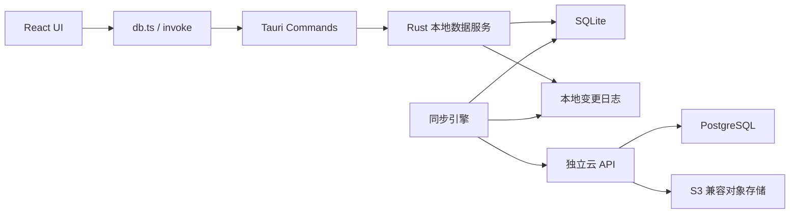
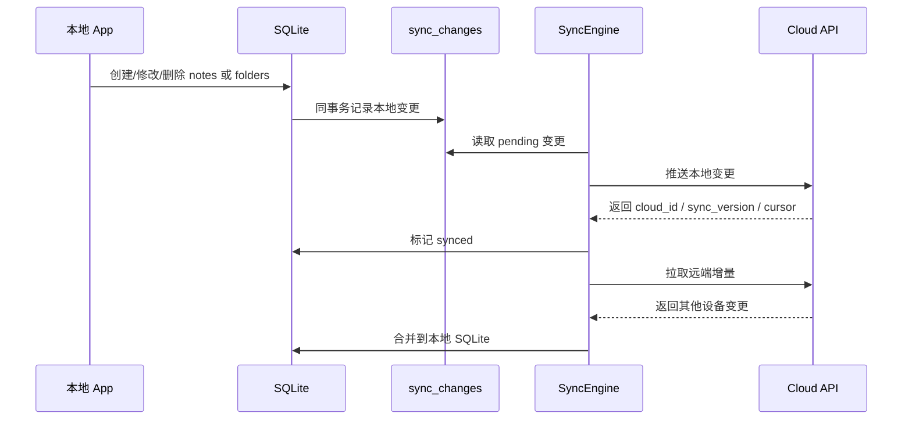

# Kova 本地版 / 云同步版规划

## 1. 产品定位

- 本地版是默认完整体验，不是阉割版：离线、隐私、速度、数据自主管理继续成立。
- 云同步版不是新 App，而是同一个 App 登录后的增强模式。
- 第一阶段云能力只覆盖：多设备同步、云备份、设备恢复。
- 明确暂缓：团队协作、实时多人编辑、公开分享、订阅计费。

## 2. 当前项目判断

项目已经具备做本地优先同步的边界：

- 前端统一桥接层在 [`d:\study\kova\src\lib\db.ts`](d:\study\kova\src\lib\db.ts)，React 不直接写 SQLite。
- 核心模型集中在 [`d:\study\kova\src-tauri\src\services\models.rs`](d:\study\kova\src-tauri\src\services\models.rs)。
- SQLite 初始化和迁移集中在 [`d:\study\kova\src-tauri\src\services\db\mod.rs`](d:\study\kova\src-tauri\src\services\db\mod.rs)。
- notes/folders 的真实写入集中在 [`d:\study\kova\src-tauri\src\services\db\notes.rs`](d:\study\kova\src-tauri\src\services\db\notes.rs) 和 [`d:\study\kova\src-tauri\src\services\db\folders.rs`](d:\study\kova\src-tauri\src\services\db\folders.rs)。
- 当前 `delete_note` 和 `delete_folder` 是硬删除，后续必须先改成软删除，否则无法稳定同步删除状态。
- 附件当前位于数据目录 `attachments/<note_id>/<filename>`，正文通过 `kova-asset://<note_id>/<filename>` 引用，后续可自然映射到对象存储。

## 3. 推荐架构

同步层应该放在本地数据库写入之后、前端业务之前；更准确地说，应放在 Rust 本地数据服务内，由本地写入事务同步生成变更日志。

关键约束：

- 前端仍然只面对本地桥接层。
- 云模式仍然读写本地 SQLite。
- 变更日志由 Rust 后端统一记录，不能分散在 React 组件里。
- AI 工具、快捷便签、导入、普通编辑都必须走同一套本地写入入口。

## 4. 版本形态

### 本地模式

- 无账号也能完整使用。
- 数据只在本地 SQLite 和本地附件目录。
- 保留手动备份、恢复、导入、导出。
- AI API Key、AI Profile 密钥、本地数据目录路径不上传。

### 云同步模式

- 用户登录后启用。
- 每台设备仍然以本地 SQLite 为主。
- 本地变更进入变更日志，后台推送到云端。
- 云端增量再同步回其他设备。
- 断网继续使用，联网后补偿同步。

## 5. 数据模型演进

第一阶段同步对象：

- `notes`
- `folders`
- 附件元数据和附件文件
- 可跨设备复用的偏好设置：主题、字体、字号、行高、编辑器视图、自动保存等

第一阶段不同步：

- AI API Key
- 本地数据目录路径
- 窗口尺寸、面板宽度、最近打开笔记、开机自启、托盘行为
- 包含本机路径或本机状态的配置

建议给 `notes`、`folders` 增加通用字段：

- `sync_status`: `pending | synced | conflict | deleted`
- `sync_version`: number
- `cloud_id`: string | null
- `deleted_at`: string | null
- `last_synced_at`: string | null
- `device_id`: string

保留本地 `id` 作为本机 UUID，新增 `cloud_id` 作为云端对象关联。这样不会破坏现有本地数据和历史备份。

## 6. 本地新增表

建议新增：

- `sync_changes`
  - 记录本机所有待同步变更。
  - 字段：`id`、`entity_type`、`entity_id`、`operation`、`payload`、`base_version`、`device_id`、`status`、`created_at`、`synced_at`、`error`。
- `sync_state`
  - 记录本设备同步游标和登录状态。
  - 字段：`device_id`、`account_id`、`last_pull_cursor`、`last_sync_at`、`enabled`。
- `sync_conflicts`
  - 记录正文冲突、云端版本、本地版本、冲突副本 ID。
- `attachment_assets`
  - 记录附件的本地路径、hash、大小、mime、所属笔记、云端对象 key、上传状态。

## 7. 同步策略

第一阶段采用非实时同步：变更队列 + 定时推送 + 拉取增量。

同步触发：

- 手动“立即同步”。
- 登录后定时同步。
- 应用启动后同步一次。
- 网络恢复后补偿同步。

## 8. 冲突策略

第一版保持简单：

- 标题、标签、文件夹位置等弱冲突字段可自动合并。
- 正文不做自动覆盖。
- 两台设备同时修改正文时，保留：
  - 当前版本
  - 冲突副本
- UI 中提供“查看冲突”和“保留/合并/删除副本”的人工处理入口。

不建议第一版做 CRDT。Kova 当前不是实时协作文档，CRDT 会明显抬高协议、存储、测试和 UI 成本。

## 9. 云端模块

建议新建独立云服务，不把云账号、对象存储、计费预留塞进 Tauri 后端。

最小模块：

- `auth`：账号、登录、刷新令牌、设备授权。
- `sync`：增量同步、版本判断、冲突标记、游标。
- `storage`：附件上传、下载、对象存储签名 URL。
- `backup`：云备份快照、恢复清单。
- `billing`：只预留边界，第一阶段不实现。
- `admin`：只预留边界，第一阶段不实现。

推荐技术：

- API：Node.js / Rust / Go 都可，优先选团队最熟悉的。
- 数据库：PostgreSQL。
- 附件：S3 兼容对象存储。
- 部署：Docker Compose 起步，后续再拆。
- 鉴权：邮箱验证码起步；OAuth/passkey 后续加。

## 10. 前端产品入口

在设置面板新增“同步”页，位置在 [`d:\study\kova\src\components\layout\SettingsPanel\index.tsx`](d:\study\kova\src\components\layout\SettingsPanel\index.tsx)。

显示状态：

- 当前模式：本地 / 云同步
- 登录账号
- 当前设备名
- 最近同步时间
- 同步中 / 已同步 / 有冲突 / 同步失败

提供操作：

- 登录 / 退出登录
- 立即同步
- 查看冲突
- 从云端恢复
- 关闭云同步

标题栏或侧边栏只显示轻量同步状态，避免干扰编辑体验。

## 11. 实施阶段

### Phase 1：本地同步基础改造

目标：当前本地数据先具备可同步能力，不接云。

- 在 [`d:\study\kova\src-tauri\src\services\db\mod.rs`](d:\study\kova\src-tauri\src\services\db\mod.rs) 增加同步字段迁移和同步表。
- 在 [`d:\study\kova\src-tauri\src\services\models.rs`](d:\study\kova\src-tauri\src\services\models.rs) 补充同步相关模型。
- 在 notes/folders 写入路径中统一记录 `sync_changes`。
- 将 notes/folders 删除从硬删除调整为软删除。
- 初始化并持久化 `device_id`。
- 查询列表默认过滤 `deleted_at IS NULL`。

### Phase 2：本地同步状态 UI

目标：即使没有云，也能看到本地同步基础状态。

- 在 [`d:\study\kova\src\lib\db.ts`](d:\study\kova\src\lib\db.ts) 增加同步状态相关桥接方法。
- 在设置面板增加“同步”页骨架。
- 展示本地模式、设备 ID、待同步变更数量。
- 增加冲突列表 UI 的占位能力。

### Phase 3：云账号与设备体系

目标：用户能登录并绑定当前设备。

- 建立独立云服务。
- 实现账号登录、刷新令牌、退出登录。
- 实现设备注册、设备名修改、设备撤销。
- App 本地保存登录态和当前设备状态。
- 设置页展示账号和设备状态。

### Phase 4：notes/folders 增量同步

目标：多设备同步核心笔记数据。

- 上传本地 `sync_changes`。
- 拉取云端增量。
- 处理创建、更新、移动、重命名、软删除。
- 实现正文冲突生成副本。
- 提供手动同步和后台自动同步。

### Phase 5：附件与云备份

目标：补齐实际使用闭环。

- 建立附件元数据表。
- 附件计算 hash，上传对象存储。
- 下载远端附件并缓存到本地 `attachments`。
- 增加手动云备份。
- 新设备支持从云端恢复。

### Phase 6：商业化与协作预留

目标：只留边界，不提前实现。

- 云容量限制。
- 多设备数量限制。
- 分享链接。
- 团队空间。
- 订阅计费。

## 12. MVP 范围

最小可上线版本建议：

- 一个账号登录。
- 多设备同步 `notes` 和 `folders`。
- 软删除。
- 手动同步 + 自动定时同步。
- 正文冲突生成副本。
- 云端整库备份。
- 附件放到第二个小版本。

这个 MVP 已经形成清晰卖点：本地优先、可离线、多设备同步、数据可恢复。

## 13. 关键取舍

- 不拆成本地版和云版两个代码库。
- 云模式不绕过本地 SQLite。
- 第一版不做实时多人协作。
- 第一版不上传用户 AI API Key。
- 先把本地数据可同步化做好，再接云服务。
- 同步记录放在 Rust 本地数据服务层，而不是 React 组件层。