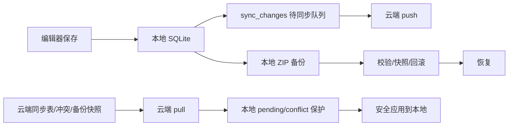

# Kova 云笔记本地文件级规划

## 0. 当前原则

- 本地优先：所有编辑先落本地 SQLite，无网也可完整使用。
- 云端增量：云端负责多设备同步、冲突记录、备份快照。
- 不静默覆盖：远端 pull、云恢复、冲突处理都不能覆盖本地未同步编辑。
- 先数据安全，再产品体验。

## 1. 已完成能力与文件状态

### 1.1 普通 pull 自动应用

状态：已做基础版。

涉及文件：

- `[D:\study\kova\src\lib\sync.ts](D:\study\kova\src\lib\sync.ts)`
  - 已具备：pull 后调用本地 apply，支持按 cursor 循环拉取。
  - 已具备：settings 变更可应用到 `localStorage`。
  - 已具备：apply 结果会统计远端变更跳过数量，避免误报全部成功。

- `[D:\study\kova\src-tauri\src\services\db\sync.rs](D:\study\kova\src-tauri\src\services\db\sync.rs)`
  - 已具备：`apply_sync_payload` 可应用 note/folder。
  - 已具备：应用前检查同实体 pending/conflict，本地未同步内容不会被远端覆盖。

### 1.2 当前编辑文章安全刷新

状态：已做基础版。

涉及文件：

- `[D:\study\kova\src\App.tsx](D:\study\kova\src\App.tsx)`
  - 已具备：同步后刷新列表；当前编辑器 dirty 时不强制覆盖当前选中文章。
  - 待加强：`quick-note-saved`、AI 数据变更、文件夹切换等刷新路径也要统一走同一套“编辑态保护”。

- `[D:\study\kova\src\components\detail\NoteDetail.tsx](D:\study\kova\src\components\detail\NoteDetail.tsx)`
  - 已具备：上报 dirty 状态。
  - 待加强：需要显示“保存中 / 保存失败 / 待同步 / 已同步”。

### 1.3 图片归档失败不阻断同步

状态：已做。

涉及文件：

- `[D:\study\kova\src\lib\assetArchive.ts](D:\study\kova\src\lib\assetArchive.ts)`
  - 已具备：单张图片上传失败时保留原地址。
  - 已具备：归档缓存是单次同步运行内 Map，不做全局长期缓存。

- `[D:\study\kova\src\lib\sync.ts](D:\study\kova\src\lib\sync.ts)`
  - 已具备：整篇图片归档异常时降级为原文同步。

### 1.4 上传 URL 归一化

状态：已做基础版。

涉及文件：

- `[D:\study\kova\src\lib\cloudApi.ts](D:\study\kova\src\lib\cloudApi.ts)`
  - 已具备：`normalizeApiBaseUrl`。
  - 已具备：上传返回相对 URL 时转为绝对 URL。
  - 待加强：云端文件服务最好返回稳定 `fileId/storageKey/url/hash/size` 结构，避免只依赖 URL。

### 1.5 本地孤儿附件清理

状态：已做基础版。

涉及文件：

- `[D:\study\kova\src-tauri\src\lib.rs](D:\study\kova\src-tauri\src\lib.rs)`
  - 已具备：扫描 `attachments`，按正文 `kova-asset://` 引用判断孤儿文件并删除。

- `[D:\study\kova\src\lib\db.ts](D:\study\kova\src\lib\db.ts)`
  - 已具备：前端桥接 `cleanupOrphanAttachments`。

- `[D:\study\kova\src\components\layout\SettingsPanel\index.tsx](D:\study\kova\src\components\layout\SettingsPanel\index.tsx)`
  - 已具备：设置页入口。
  - 待加强：清理前可先预览清单，或提供“仅统计不删除”。

### 1.6 云备份 / 设备恢复入口

状态：已做基础版。

涉及文件：

- `[D:\study\kova\src\components\layout\SettingsPanel\index.tsx](D:\study\kova\src\components\layout\SettingsPanel\index.tsx)`
  - 已具备：云备份：本地 ZIP → 上传 → 登记快照。
  - 已具备：设备恢复：读取最新快照 → 下载 → 校验 → 恢复。
  - 已具备：云恢复会比对 `fileSize/sha256`，恢复前自动生成本地备份，恢复失败时尝试回滚。
  - 待加强：快照列表选择与更详细的恢复信息展示。

- `[D:\study\kova\src\lib\cloudApi.ts](D:\study\kova\src\lib\cloudApi.ts)`
  - 已具备：备份快照登记与分页查询接口。

- `[D:\study\tiny_rbac\src\main\java\com\ynx\hiro\modules\kova\sync\controller\KovaSyncController.java](D:\study\tiny_rbac\src\main\java\com\ynx\hiro\modules\kova\sync\controller\KovaSyncController.java)`
  - 已具备：`/backup-snapshots` 登记和分页查询。
  - 待加强：服务端校验文件归属、hash、大小、状态流转。

## 2. 待办清单：按优先级推进

## P0：先补数据安全

### P0-1：pull 应用前保护本地 pending/conflict

目标：远端变更不能直接覆盖本地离线未推送编辑。

涉及文件：

- `[D:\study\kova\src-tauri\src\services\db\sync.rs](D:\study\kova\src-tauri\src\services\db\sync.rs)`
  - 增加本地待同步检测：note/folder 应用前查 `sync_changes`。
  - 如果同实体存在 pending/conflict，不覆盖本地内容。
  - 返回结果要能表达：已应用、跳过、产生冲突。

- `[D:\study\kova\src\lib\sync.ts](D:\study\kova\src\lib\sync.ts)`
  - 对 skipped/conflict 计数。
  - 同步完成 toast 和状态栏展示更准确。

验证：

- 设备 A 离线编辑同一篇文章，设备 B 云端已更新；设备 A pull 后本地编辑不丢。
- `npm run build`、`cargo check` 通过。

### P0-2：云恢复校验、恢复前快照、失败回滚

目标：恢复是高风险操作，必须可验证、可回退。

涉及文件：

- `[D:\study\kova\src-tauri\src\services\db\mod.rs](D:\study\kova\src-tauri\src\services\db\mod.rs)`
  - 已具备：新 ZIP 备份写入 `manifest.json`。
  - 已具备：恢复时校验 ZIP 必须包含 `kova.db`，如果存在 `manifest.json` 则校验格式与数据库声明。
  - 已具备：恢复前备份与失败回滚由前端恢复编排触发。
  - 待加强：更彻底的临时目录整包校验后原子替换附件目录。

- `[D:\study\kova\src-tauri\src\lib.rs](D:\study\kova\src-tauri\src\lib.rs)`
  - 已具备：下载云备份后返回本地路径。
  - 已具备：前端可读取本地备份二进制并计算 SHA-256。
  - 待加强：可下沉为 Rust 侧文件大小和 sha256 命令，降低大文件前端内存占用。

- `[D:\study\kova\src\components\layout\SettingsPanel\index.tsx](D:\study\kova\src\components\layout\SettingsPanel\index.tsx)`
  - 已具备：云恢复下载后比对云端登记的 `sha256/fileSize`。
  - 已具备：所有恢复动作前先生成本地 ZIP 备份。
  - 已具备：恢复失败时自动尝试回滚，并在错误信息中保留恢复前备份路径。

验证：

- 正常 ZIP 可恢复。
- 篡改 ZIP 会拒绝恢复。
- 恢复失败后旧数据仍可打开。

### P0-3：服务端备份快照登记校验

目标：云端不能登记不可用、非本人或 hash 不匹配的备份包。

完成状态：已做。

涉及文件：

- `[D:\study\tiny_rbac\src\main\java\com\ynx\hiro\modules\kova\sync\controller\KovaSyncController.java](D:\study\tiny_rbac\src\main\java\com\ynx\hiro\modules\kova\sync\controller\KovaSyncController.java)`
  - 已保持入口不变，继续委托业务层处理当前登录用户上下文。

- `D:\study\tiny_rbac\src\main\java\com\ynx\hiro\modules\kova\sync\service\impl\KovaSyncServiceImpl.java`
  - 已具备：快照登记时校验文件存在、归属当前用户、上传完成、ZIP 类型、大小一致、SHA-256 一致。
  - 已具备：兼容前端登记绝对 URL 与文件表相对 URL 两种 `storageKey` 形式。
  - 已具备：快照状态由服务端写入 `available`，不再信任前端传入状态。

- `[D:\study\tiny_rbac\src\main\java\com\ynx\hiro\modules\system\file\service\impl\SysFileServiceImpl.java](D:\study\tiny_rbac\src\main\java\com\ynx\hiro\modules\system\file\service\impl\SysFileServiceImpl.java)`
  - 已复用现有文件记录与下载能力完成校验。

验证：

- 非本人 storageKey 不能登记。
- hash 不匹配不能登记为 available。
- `mvn -DskipTests clean compile` 通过。

## P1：同步模型可靠化

### P1-1：同步队列压缩与重试状态

涉及文件：

- `[D:\study\kova\src-tauri\src\services\db\notes.rs](D:\study\kova\src-tauri\src\services\db\notes.rs)`
- `D:\study\kova\src-tauri\src\services\db\folders.rs`
- `[D:\study\kova\src-tauri\src\services\db\sync.rs](D:\study\kova\src-tauri\src\services\db\sync.rs)`

目标：

- 同一实体连续编辑只保留最新 pending。
- 增加失败原因、重试次数、最后尝试时间。
- 同步失败后用户可见、可重试。

### P1-2：字段级冲突策略

涉及文件：

- `D:\study\tiny_rbac\src\main\java\com\ynx\hiro\modules\kova\sync\service\impl\KovaSyncServiceImpl.java`
- `[D:\study\kova\src\components\layout\SyncConflictDialog.tsx](D:\study\kova\src\components\layout\SyncConflictDialog.tsx)`

目标：

- 标题、正文、标签、移动、删除分别判断。
- 删除 vs 编辑不默认删除编辑内容。
- 手动合并从 JSON 改为笔记内容对比与合并结果预览。

### P1-3：云端 change_version 并发安全

涉及文件：

- `D:\study\tiny_rbac\src\main\java\com\ynx\hiro\modules\kova\sync\service\impl\KovaSyncServiceImpl.java`
- `D:\study\tiny_rbac\src\main\resources\db\changelog\v1.2.8\0609-kova-sync-business-tables.sql`

目标：

- 不再依赖 `max + 1`。
- 改为用户维度同步状态表、数据库序列或带重试的唯一键冲突处理。

## P2：附件资产化

### P2-1：本地附件索引

涉及文件：

- `[D:\study\kova\src-tauri\src\lib.rs](D:\study\kova\src-tauri\src\lib.rs)`
- `[D:\study\kova\src\lib\assetArchive.ts](D:\study\kova\src\lib\assetArchive.ts)`
- `[D:\study\kova\src\lib\db.ts](D:\study\kova\src\lib\db.ts)`

目标：

- 附件有本地路径、noteId、hash、size、mime、云端 URL、上传状态。
- 清理孤儿附件时可按索引和正文双重判断。

### P2-2：打通云端 `kova_attachment`

涉及文件：

- `[D:\study\kova\src\lib\sync.ts](D:\study\kova\src\lib\sync.ts)`
- `D:\study\tiny_rbac\src\main\java\com\ynx\hiro\modules\kova\sync\service\impl\KovaSyncServiceImpl.java`

目标：

- `attachments` 不再是空数组。
- 支持附件推送、拉取、缺失下载、删除同步。

## P3：离线体验产品化

### P3-1：状态栏同步状态

状态：已做。

涉及文件：

- `[D:\study\kova\src\components\StatusBar.tsx](D:\study\kova\src\components\StatusBar.tsx)`
- `[D:\study\kova\src\App.tsx](D:\study\kova\src\App.tsx)`
- `[D:\study\kova\src\lib\db.ts](D:\study\kova\src\lib\db.ts)`

目标：

- 显示：离线/在线、本地已保存、待同步数量、失败数量、最近同步时间。

已完成：

- 状态栏显示在线/离线、待同步、失败、冲突、最近同步时间。
- 失败状态可点击手动重试。

### P3-2：保存失败可见化

状态：已做。

涉及文件：

- `[D:\study\kova\src\hooks\useNotes.ts](D:\study\kova\src\hooks\useNotes.ts)`
- `[D:\study\kova\src\components\detail\NoteDetail.tsx](D:\study\kova\src\components\detail\NoteDetail.tsx)`
- `[D:\study\kova\src\App.tsx](D:\study\kova\src\App.tsx)`

目标：

- 保存中、保存失败、点击重试。
- 乐观更新失败后不误导用户。

已完成：

- 编辑器显示保存中、保存失败、未保存、已保存状态。
- 保存失败不会误报已保存，失败文案可点击重试。

### P3-3：自动同步

状态：已做。

涉及文件：

- `[D:\study\kova\src\App.tsx](D:\study\kova\src\App.tsx)`
- `[D:\study\kova\src\lib\sync.ts](D:\study\kova\src\lib\sync.ts)`

目标：

- 启动同步、网络恢复同步、空闲定时同步。
- 失败指数退避。
- 避免并发同步。

已完成：

- 登录后启动静默同步。
- 网络恢复后自动同步。
- 前台可见时定时静默同步。
- 同步失败按指数退避，且复用现有并发锁。
- `npm run build` 通过。

## P4：设备与恢复体验

### P4-1：设备管理

状态：已做。

涉及文件：

- `D:\study\tiny_rbac\src\main\java\com\ynx\hiro\modules\kova\sync\controller\KovaSyncController.java`
- `[D:\study\kova\src\lib\cloudApi.ts](D:\study\kova\src\lib\cloudApi.ts)`
- `[D:\study\kova\src\components\layout\SettingsPanel\index.tsx](D:\study\kova\src\components\layout\SettingsPanel\index.tsx)`

目标：

- 设备列表、重命名、撤销设备、最后同步时间。

已完成：

- 后端新增设备列表、重命名、撤销接口。
- 前端设置页显示云端设备、最近同步时间，并支持重命名/撤销。

### P4-2：首次同步向导

状态：已做。

涉及文件：

- `[D:\study\kova\src\App.tsx](D:\study\kova\src\App.tsx)`
- `[D:\study\kova\src\components\layout\LoginPanel.tsx](D:\study\kova\src\components\layout\LoginPanel.tsx)`
- `[D:\study\kova\src\components\layout\SettingsPanel\index.tsx](D:\study\kova\src\components\layout\SettingsPanel\index.tsx)`

目标：

- 登录后明确选择：本地上传、云端恢复、手动合并。

已完成：

- 登录面板已提供本地上传、云端恢复、手动合并入口。
- 主窗口接收入口动作并转入同步、恢复列表或冲突处理。

### P4-3：云备份列表恢复

状态：已做。

涉及文件：

- `[D:\study\kova\src\components\layout\SettingsPanel\index.tsx](D:\study\kova\src\components\layout\SettingsPanel\index.tsx)`
- `[D:\study\kova\src\lib\cloudApi.ts](D:\study\kova\src\lib\cloudApi.ts)`

目标：

- 不再默认恢复最新快照。
- 列出时间、设备、大小、笔记数、附件数、hash。
- 用户选择后再恢复。

已完成：

- 设置页读取云备份列表，不再默认恢复最新快照。
- 快照列表展示时间、大小、笔记数、文件夹数、附件数和 SHA-256。
- 用户点击快照后才进入恢复确认与校验流程。
- `npm run build`、`mvn -DskipTests clean compile` 通过。

## 3. 第一阶段建议开始范围

建议第一轮只做 P0，不扩散：

1. `protect-pull-local-edits`
2. `safe-cloud-restore`
3. `P0-3 服务端快照登记校验`

原因：这三项直接决定“不会丢数据”。状态栏、设备管理、附件完整同步可以后置。

## 4. 开始前确认

如果你确认，我会先从第一阶段 P0 开始，按这个顺序实施：

1. 先改本地 pull 应用保护。
2. 再改云恢复校验与恢复前快照。
3. 最后改云端快照登记校验。
4. 每一项完成后跑对应构建检查。