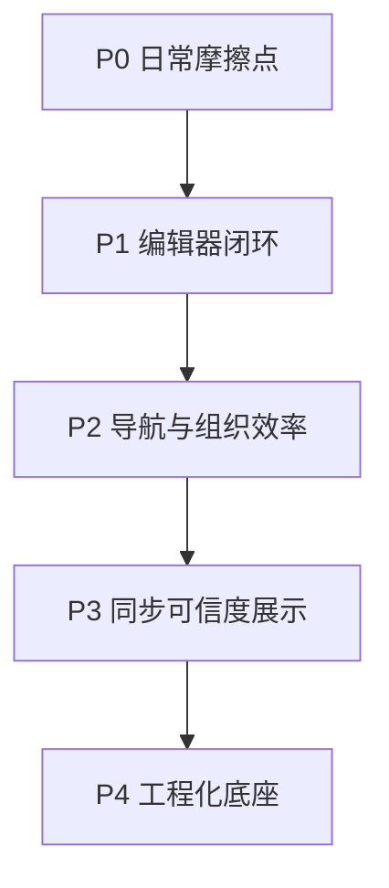

# Kova 下一阶段完善规划

## 当前判断

这个项目已经不是“从 0 到 1”阶段，而是“从能用到顺手”的阶段。

从现状看，能力面已经覆盖：
- 主窗口 + 快捷便签双入口
- 本地笔记、文件夹、Markdown 编辑、导入导出
- AI 对话 + 工具调用
- 本地附件
- 云同步、冲突、诊断、备份

当前更像是 4 条主线并行，但你刚才选择了 **产品体验优先**，所以接下来建议按照下面顺序推进。

## 现有模块边界

- 主界面编排集中在 [D:\study\kova\src\App.tsx](D:\study\kova\src\App.tsx)
- 笔记列表状态集中在 [D:\study\kova\src\hooks\useNotes.ts](D:\study\kova\src\hooks\useNotes.ts)
- 编辑体验集中在 [D:\study\kova\src\components\detail\NoteDetail.tsx](D:\study\kova\src\components\detail\NoteDetail.tsx)
- 列表交互集中在 [D:\study\kova\src\components\shared\NoteList.tsx](D:\study\kova\src\components\shared\NoteList.tsx)
- 搜索入口目前较轻，在 [D:\study\kova\src\components\shared\SearchBar.tsx](D:\study\kova\src\components\shared\SearchBar.tsx)
- 同步诊断能力已经存在，在 [D:\study\kova\src\lib\sync.ts](D:\study\kova\src\lib\sync.ts) 和 [D:\study\kova\src-tauri\src\services\db\sync.rs](D:\study\kova\src-tauri\src\services\db\sync.rs)
- 设置分区已经预留了“同步与云端”“数据与备份”，在 [D:\study\kova\src\components\layout\SettingsPanel\settings-schema.ts](D:\study\kova\src\components\layout\SettingsPanel\settings-schema.ts)

## 优先级路线

### P0：先补“日常使用摩擦点”

目标是让用户在高频链路里少停顿、少迷路、少怀疑“有没有保存成功”。

建议先做 4 个点：
- 列表与编辑联动更稳
  - 当前 `App.tsx` 同时维护 `notes / allNotes / folders / selectedNote / selectedIds / selectedFolderId / search / syncStatus`，主容器状态已经偏重
  - 先梳理“选择态”“筛选态”“编辑态”的边界，减少切换笔记、切换文件夹、AI 改数据后出现的感知跳变
- 保存反馈更明确
  - `NoteDetail.tsx` 已经有 `idle / saving / failed`，但建议把“未保存 / 保存中 / 已保存 / 保存失败 / 与远端冲突”做成统一状态语言，覆盖标题、正文、附件插入、快捷便签写回
- 列表操作可预期
  - `NoteList.tsx` 已经具备多选、长按、右键、批量移动/导出，但交互层级偏深
  - 需要补“当前选中了什么、批量动作影响什么、动作完成后焦点落在哪里”这条体验链
- 搜索从“输入框”升级为“检索能力”
  - 现在 `SearchBar.tsx` 只是轻量输入入口
  - 下一步应该补：搜索范围、空结果反馈、最近搜索、按标题/正文/标签过滤，至少让检索可解释

### P1：补“编辑器闭环”

目标是让编辑器成为产品核心，而不是一个可用但容易紧张的输入框。

建议做 5 个点：
- 自动保存策略可感知
  - 现在 `NoteDetail.tsx` 采用延时保存，逻辑可用，但用户缺少“何时真正落盘”的明确感知
- 草稿保护
  - 重点场景：切换笔记、关闭窗口、同步刷新、AI 工具改写当前笔记时，本地未提交内容如何处理
- 分栏模式联动优化
  - 现有编辑区和预览区已支持同步滚动，但建议增加“跟随标题跳转 / 图片定位 / 数学公式渲染失败提示”这种细节收口
- 附件插入链路统一
  - 当前附件有“先云后本地”的分支判断，体验层要统一成“插图成功/失败/回退”的单一路径
- 编辑偏好收敛
  - 把视图模式、分栏比例、tab size、自动保存等设置形成一个稳定的“编辑人格”，避免多个入口分散修改

### P2：补“导航与组织效率”

目标是让笔记多起来后仍然好找、好收、好归档。

建议做 4 个点：
- 文件夹视角和搜索视角统一
  - 现在目录筛选和搜索结果更像两套入口，建议统一成一个“当前上下文”模型
- 增加排序与筛选显式控制
  - 代码里已有 `kova-sort-field / kova-sort-dir` 的痕迹，可以把它正式前置到界面
- 强化标签体系
  - 目前标签更多是数据字段，不像稳定导航入口
  - 建议补标签点击过滤、标签聚合视图、标签管理最小界面
- 历史与最近访问
  - 对桌面笔记来说，“刚刚看过/改过/导入过”是非常高价值的捷径

### P3：补“同步与本地可信度展示”

虽然你这轮优先的是体验，但同步已经进入主窗口日常链路，所以不能只藏在设置页。

建议做 4 个点：
- 主界面可见的同步状态
  - 不是只显示“正在同步”，而是显示“本地待同步数 / 失败数 / 上次成功时间 / 是否离线”
- 冲突处理入口前置
  - 现在代码里已经有冲突计数和对话框能力，下一步要让用户更早知道“哪里冲突、影响哪些笔记、处理后会怎样”
- 诊断从技术数据转成人话
  - `sync.ts` 的 diagnostics 结构已经很完整，但 UI 需要把它翻译成可操作的信息
- 数据安全闭环
  - 同步、备份、恢复、附件清理，这 4 条链路要形成一套统一的安全叙事

### P4：补“工程化底座”

这是你后面继续演进的门槛，不一定第一批做，但一定要尽快排上。

建议做 4 个点：
- 为高风险链路补最小回归测试
  - 笔记创建/更新/删除
  - 文件夹移动与批量操作
  - 同步队列、冲突、恢复
  - AI 工具改数据后的刷新
- 为关键状态补埋点式日志
  - 不是为了远程监控，而是为了本地排障和复现
- 降低 `App.tsx` 的编排复杂度
  - 这是当前前端最明显的维护压力点，后续体验迭代越多，这里越容易变成阻塞点
- 补发布前检查清单
  - 尤其是快捷便签、托盘、窗口状态、同步、恢复、AI 配置切换这几条跨模块链路

## 推荐迭代顺序

## 具体建议的两个近期迭代

### 迭代一

范围控制在“主界面高频体验收口”：
- 统一保存状态语言
- 梳理列表选择态与编辑态
- 补搜索结果反馈与排序入口
- 把同步状态最小化地露到主界面

涉及重点文件：
- [D:\study\kova\src\App.tsx](D:\study\kova\src\App.tsx)
- [D:\study\kova\src\components\detail\NoteDetail.tsx](D:\study\kova\src\components\detail\NoteDetail.tsx)
- [D:\study\kova\src\components\shared\NoteList.tsx](D:\study\kova\src\components\shared\NoteList.tsx)
- [D:\study\kova\src\components\shared\SearchBar.tsx](D:\study\kova\src\components\shared\SearchBar.tsx)
- [D:\study\kova\src\components\StatusBar.tsx](D:\study\kova\src\components\StatusBar.tsx)

### 迭代二

范围控制在“编辑器和同步信任感”：
- 草稿保护
- 附件插入结果统一
- 冲突提示入口前置
- 设置页补同步/数据说明与诊断入口

涉及重点文件：
- [D:\study\kova\src\components\detail\NoteDetail.tsx](D:\study\kova\src\components\detail\NoteDetail.tsx)
- [D:\study\kova\src\lib\sync.ts](D:\study\kova\src\lib\sync.ts)
- [D:\study\kova\src\components\layout\SettingsPanel\index.tsx](D:\study\kova\src\components\layout\SettingsPanel\index.tsx)
- [D:\study\kova\src\components\layout\SettingsPanel\settings-schema.ts](D:\study\kova\src\components\layout\SettingsPanel\settings-schema.ts)
- [D:\study\kova\src\components\layout\SyncConflictDialog.tsx](D:\study\kova\src\components\layout\SyncConflictDialog.tsx)

## 不建议现在优先做的事

- 先大规模重构前后端目录
- 先扩更多 AI 工具数量
- 先做过重的云端能力
- 先铺很全的自动化测试体系

原因很简单：现在最值钱的是把“高频使用感”打磨平，先让已有能力之间更顺、更可信。

## 我建议的结论

如果你希望接下来两周就能明显感觉产品变顺手，最值得优先做的是：
- 保存状态统一
- 搜索能力升级
- 列表/编辑选择态梳理
- 主界面同步状态可见

这四项会直接提升每天都能感知到的质量，而且不会把架构推翻重来。