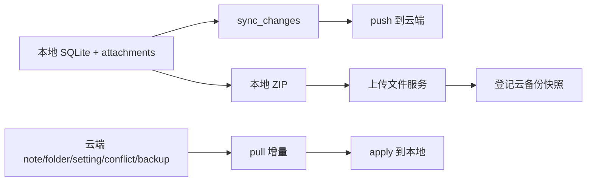

# Kova 云笔记与本地离线模式优化规划

## 当前定位

Kova 现在已经具备基础骨架：

核心优点：本地离线编辑已经成立，云端同步、冲突、备份快照也有接口雏形。

核心短板：目前更像“能同步”，还不是“可靠云笔记”。主要风险集中在本地未同步内容保护、恢复校验、附件元数据、冲突闭环、用户可见同步状态。

## P0：数据安全优先

目标：任何同步、恢复、冲突处理都不能静默丢数据。

- 优化 pull 应用保护
  - 涉及 `[D:\study\kova\src\lib\sync.ts](D:\study\kova\src\lib\sync.ts)`、`[D:\study\kova\src-tauri\src\services\db\sync.rs](D:\study\kova\src-tauri\src\services\db\sync.rs)`。
  - pull 到远端变更时，先检查本地同一笔记/文件夹是否有 pending/conflict。
  - 如果本地有未推送变更，不直接覆盖，转为冲突或延后应用。

- 补恢复校验与回滚
  - 涉及 `[D:\study\kova\src-tauri\src\services\db\mod.rs](D:\study\kova\src-tauri\src\services\db\mod.rs)`、`[D:\study\kova\src\components\layout\SettingsPanel\index.tsx](D:\study\kova\src\components\layout\SettingsPanel\index.tsx)`。
  - 云恢复下载后校验 `sha256`、文件大小、ZIP 是否包含合法 `kova.db`、附件路径是否合法。
  - 恢复前自动生成本地安全快照。
  - 恢复流程改成：下载到临时文件 → 校验 → 临时目录解包 → 校验通过 → 替换当前数据。

- 云端快照登记校验
  - 涉及 `[D:\study\tiny_rbac\src\main\java\com\ynx\hiro\modules\kova\sync\controller\KovaSyncController.java](D:\study\tiny_rbac\src\main\java\com\ynx\hiro\modules\kova\sync\controller\KovaSyncController.java)` 以及 sync service。
  - 服务端不只保存 `storageKey`，还要验证文件归属当前用户、大小、hash、类型。
  - 快照状态建议改为 `creating / available / invalid / deleted`。

## P1：同步模型补完整

目标：让离线编辑、多设备编辑、删除、移动、标签变更都有明确结果。

- 同步队列可靠化
  - 涉及 `[D:\study\kova\src-tauri\src\services\db\sync.rs](D:\study\kova\src-tauri\src\services\db\sync.rs)`。
  - `sync_changes` 增加或补齐：重试次数、最后错误、变更唯一 ID、最后尝试时间。
  - 同一笔记连续编辑应压缩为一条最新变更，避免队列膨胀。
  - push ack 应尽量按变更 ID 确认，而不是只按实体 ID 批量确认。

- 冲突策略细化
  - 当前应从“整篇冲突”拆成字段级判断：标题、正文、标签、文件夹移动、删除。
  - 删除 vs 编辑必须单独处理：默认不直接丢编辑内容。
  - 手动合并不要让用户编辑 JSON，应展示本地版本、云端版本、合并结果。

- 版本号并发安全
  - 涉及 tiny_rbac 的 `KovaSyncServiceImpl`。
  - 云端 `change_version` 不建议长期使用 `max + 1` 模式，需改为用户维度序列表或数据库原子递增，避免并发设备同步撞版本。

## P2：附件与图片做成真正云资产

目标：图片不是“正文里的 URL 凑合可用”，而是可校验、可恢复、可清理的附件资产。

- 建立本地附件索引
  - 涉及 `[D:\study\kova\src\lib\assetArchive.ts](D:\study\kova\src\lib\assetArchive.ts)`、`[D:\study\kova\src-tauri\src\lib.rs](D:\study\kova\src-tauri\src\lib.rs)`。
  - 附件记录：本地路径、noteId、sha256 或 md5、大小、mime、云端 URL、上传状态。

- 使用云端 `kova_attachment`
  - 当前前端 push 里 `attachments` 还是空数组。
  - 后续应把附件作为同步实体推送，支持拉取时发现本地缺失附件并下载。

- 存储策略
  - 图片建议按 hash 去重。
  - 备份包与图片分目录存储：`kova/{userId}/assets/{hash}`、`kova/{userId}/backups/{snapshotId}.zip`。
  - 服务端定期清理孤儿文件和过期快照。

## P3：离线体验产品化

目标：用户知道当前是“已保存、待同步、同步失败、离线可编辑、冲突待处理”。

- 状态栏增加同步状态
  - 涉及 `[D:\study\kova\src\components\StatusBar.tsx](D:\study\kova\src\components\StatusBar.tsx)`、`[D:\study\kova\src\App.tsx](D:\study\kova\src\App.tsx)`。
  - 展示：本地已保存、待同步数量、最近同步时间、离线状态、失败数量。

- 保存失败可见化
  - 涉及 `[D:\study\kova\src\hooks\useNotes.ts](D:\study\kova\src\hooks\useNotes.ts)`、`[D:\study\kova\src\components\detail\NoteDetail.tsx](D:\study\kova\src\components\detail\NoteDetail.tsx)`。
  - 当前 `handleUpdateTitle/handleUpdateContent` 是乐观更新，保存失败时用户感知弱。
  - 需要增加保存中、保存失败、点击重试。

- 自动同步策略
  - 启动后同步一次。
  - 网络恢复后同步一次。
  - 空闲时定时同步。
  - 退出前尽量 flush 本地 pending。
  - 失败时指数退避，不要频繁刷接口。

## P4：云账户、设备和恢复入口完善

目标：让多设备使用可控、可解释、可恢复。

- 设备管理
  - 云端增加设备列表、重命名、撤销设备、最后同步时间、设备状态。
  - 客户端设置页展示当前设备 ID、设备名、上次同步时间。

- 首次同步向导
  - 三种模式明确选择：
    - 本地上传为主
    - 云端恢复为主
    - 手动合并
  - 避免第一次登录后用户不知道云端和本地谁覆盖谁。

- 云备份列表
  - 当前设备恢复默认取最新快照，后续应展示快照列表：时间、设备、大小、笔记数、附件数、hash。
  - 恢复前展示“将覆盖本机”，并告诉用户已自动生成恢复前备份。

## 推荐实施顺序

1. 先做 P0：pull 本地 pending 保护、云恢复 hash 校验、恢复前快照与回滚。
2. 再做 P1：同步队列可靠化、字段级冲突、云端版本并发安全。
3. 再做 P2：附件索引、附件实体同步、云端存储生命周期。
4. 再做 P3/P4：状态栏、自动同步、设备管理、首次同步向导。

## 关键取舍

- 本地永远是第一写入点：无网也能完整编辑。
- 云端是多设备交换与备份中心：不能默认覆盖本地未同步编辑。
- 恢复是高风险操作：必须先校验、先备份、再替换。
- 附件必须资产化：只改 Markdown URL 不足以支撑完整云笔记。