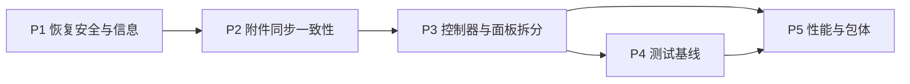

# Kova 同步与性能整治计划

## 目标切分
- P1 先把“恢复是否可做”的判断从前端挪到 Rust，形成统一恢复入口：选包/下载包 → Rust 预检 → 临时解包校验 → 明确恢复结果。
- P2 把附件同步从“按文件路径处理”提升为“按内容指纹 + 云端映射处理”，减少重复上传、重复下载和脏预览资源。
- P3 把当前集中在 `App` 与 `SettingsPanel` 的同步控制/设置面板状态拆成清晰模块，降低后续测试和性能优化阻力。
- P4 建立最小可运行测试基线：前端组件链路、Rust 数据/恢复链路、同步契约桩；真实后端链路单列为外部仓库依赖。
- P5 聚焦大文档场景，控制编辑输入成本、预览重渲染成本和主包首屏体积。

## 当前证据
- 主同步控制器集中在 [D:\study\kova\src\App.tsx](D:\study\kova\src\App.tsx)，同时承载窗口状态、同步状态、冲突、AI 面板、拖拽导入等职责，已经是拆分热点。
- 设置面板集中在 [D:\study\kova\src\components\layout\SettingsPanel\index.tsx](D:\study\kova\src\components\layout\SettingsPanel\index.tsx)，同时混合了主题、字体、快捷键、云设备、备份恢复、清理动作和同步诊断。
- Rust 已经持有备份/恢复与附件清理能力，桥接暴露在 [D:\study\kova\src\lib\db.ts](D:\study\kova\src\lib\db.ts) 的 `backupData`、`restoreData`、`cleanupOrphanAttachments` 等接口；说明 P1/P2 可以尽量下沉 Rust 后保持前端只做展示。
- 同步统计结构已存在于 [D:\study\kova\src\lib\sync.ts](D:\study\kova\src\lib\sync.ts) 的 `SyncRunDiagnostics`，其中已经有 `attachments` 与 `assets` 维度，适合扩展成更精确的附件上传/下载/复用统计。
- 附件索引已存在于 [D:\study\kova\src-tauri\src\services\db\mod.rs](D:\study\kova\src-tauri\src\services\db\mod.rs) 和 [D:\study\kova\src-tauri\src\services\db\sync.rs](D:\study\kova\src-tauri\src\services\db\sync.rs)，字段包含 `sha256`、`cloud_url`、`cloud_file_id`、`upload_status`，说明去重/复用逻辑可以建立在现有表上，不必另起表。
- Markdown 预览在 [D:\study\kova\src\components\shared\MarkdownPreview.tsx](D:\study\kova\src\components\shared\MarkdownPreview.tsx) 中每张 `kova-asset://` 图片都会单独转 object URL；大文档下这是明显的预览放大点。
- 编辑器在 [D:\study\kova\src\components\shared\CodeEditor.tsx](D:\study\kova\src\components\shared\CodeEditor.tsx) 中对外部值变化采用整篇替换；结合 [D:\study\kova\src\components\detail\NoteDetail.tsx](D:\study\kova\src\components\detail\NoteDetail.tsx) 的标题/内容本地状态，这里是大文档编辑的主要成本中心。
- 当前仓库没有现成测试文件，也未接入 `vitest`、`@testing-library` 或 Rust 测试基线，因此 P4 需要从 0 到 1 建立最小框架。

## 建议落地顺序

- 先做 P1：因为恢复链路一旦出错会直接影响用户数据，优先级最高。
- 再做 P2：附件同步逻辑会影响恢复后的数据完整性、同步诊断可信度和清理安全性。
- 接着做 P3：只有把同步控制和设置子域拆开，P4/P5 才能低成本覆盖。
- P4 在 P3 后落地：避免测试基线绑定旧结构，后面重构时重复返工。
- P5 最后做：等模块边界稳定后再进行懒加载和渲染节流，收益更稳定。

## 分项实施方案

### P1 备份恢复链路
- Rust 侧在 [D:\study\kova\src-tauri\src\services\db\mod.rs](D:\study\kova\src-tauri\src\services\db\mod.rs) 补一个恢复预检模型，输出至少这几类信息
  - 包格式是否合法
  - 必需文件是否齐全（数据库、配置、设置、附件目录）
  - SQLite 文件是否可打开
  - 附件目录是否存在/是否为空
  - 版本与来源摘要
  - 是否允许继续恢复
- 现有 `restore_data` 命令改成两段式
  - `inspect_restore_archive(src)`：只读预检，前端拿到结构化结果后展示
  - `restore_data(src, confirmed)`：内部先解包到临时目录，再校验清单、校验数据库可读性，最后原子替换数据目录
- 恢复信息统一由 Rust 生成“用户可读结果 + 机器可读详情”，前端只负责分级展示，不再自己拼错误文案。
- 设置面板中的恢复交互从“选文件后直接确认恢复”改成“选文件/云端快照 → 预检摘要 → 二次确认 → 执行恢复 → 成功后提示重启”。
- 备份也一起补摘要元数据，避免以后恢复只能靠文件名猜来源。

### P2 附件同步与清理
- 以 `attachment_index.sha256` 作为内容级去重键，优先复用已有 `cloud_file_id/cloud_url`，只在内容首次出现时上传。
- 缺失下载复用分两层
  - 本地缺文件但索引还在时，优先按 `cloud_url/cloud_file_id` 补拉
  - 多条笔记引用同内容时，只下载一次并回填所有引用关系
- 孤儿附件清理从“只删磁盘文件”扩展成“预览缓存/对象 URL 生命周期清理 + 索引状态回写 + 统计输出”。
- 在 [D:\study\kova\src\lib\sync.ts](D:\study\kova\src\lib\sync.ts) 扩展附件同步统计口径
  - 上传：新传、复用、跳过、失败
  - 下载：新拉取、命中本地、命中云端映射、失败
  - 清理：磁盘删除数、索引删除数、释放字节数
- 优先把规则下沉到 Rust/同步层，避免前端各处散落附件判断。

### P3 结构拆分
- `App` 拆成三层
  - 应用壳：窗口布局、面板开关、选中态
  - 同步控制器：在线状态、自动同步节流、冲突计数、诊断广播
  - 数据协调层：笔记/目录刷新、拖拽导入、AI 数据变更后的刷新策略
- `SettingsPanel` 拆成子模块
  - 外观与编辑偏好
  - 快捷便签与快捷键
  - 数据目录与备份恢复
  - 云端设备与同步诊断
  - 清理与维护动作
- 首次同步向导独立成组件，不再挤在 `App` 的条件分支里；它只处理
  - 登录后首次同步说明
  - 数据来源选择/风险提示
  - 同步前检查结果
  - 执行状态与完成跳转
- 目标不是纯拆文件，而是把状态作用域收紧，减少同一组件既持有 UI 状态又持有同步副作用。

### P4 测试基线与回归清单
- 前端基线
  - 新增 `vitest + @testing-library/react` 最小基线
  - 先测 3 条核心链路：恢复预检结果展示、同步诊断展示、首次同步向导状态流转
- Rust 基线
  - 先补纯数据库/文件系统导向测试：恢复预检、临时解包失败回滚、附件索引去重与孤儿清理统计
  - 尽量避开 Tauri UI，优先覆盖 `services/db/*` 纯逻辑
- 后端同步基线
  - 当前仓库先建立契约桩：push/pull、附件 ACK、冲突响应、缺失文件重拉
  - 真实后端自动化测试作为外部依赖项，待你提供后端仓库后再把同一份契约转成联调测试
- 手动回归清单
  - 本地备份 → 预检失败/成功 → 恢复 → 重启验证
  - 附件新增/去重/缺失补拉/孤儿清理
  - 首次登录同步向导
  - 冲突处理与状态栏统计
  - 大文档编辑、分栏预览、AI 面板并开、打包产物体积对比

### P5 大文档与包体优化
- 编辑器侧
  - 避免整篇内容被不必要回灌；把外部同步更新限定在 note 切换或远端覆写场景
  - 为自动保存与预览增加节流窗口，避免每次输入都推高渲染链路
- 预览侧
  - Markdown 渲染结果按内容摘要缓存
  - `kova-asset://` 图片读取做缓存与失效管理，减少重复 object URL 构建
  - Lightbox/KaTeX 等重依赖改成按需加载
- 结构侧
  - `SettingsPanel`、`AIChatPanel`、冲突对话框、首次同步向导优先做懒加载
- 构建侧
  - 调整 [D:\study\kova\vite.config.ts](D:\study\kova\vite.config.ts) 的 chunk 切分，把编辑器、Markdown、Lightbox、AI 面板拆成独立块
  - 输出构建体积基线，至少比较主入口首包、预览相关 chunk、AI 相关 chunk

## 关键改动文件
- Rust 恢复/备份与附件索引
  - [D:\study\kova\src-tauri\src\lib.rs](D:\study\kova\src-tauri\src\lib.rs)
  - [D:\study\kova\src-tauri\src\services\db\mod.rs](D:\study\kova\src-tauri\src\services\db\mod.rs)
  - [D:\study\kova\src-tauri\src\services\db\sync.rs](D:\study\kova\src-tauri\src\services\db\sync.rs)
- 前端同步与设置
  - [D:\study\kova\src\App.tsx](D:\study\kova\src\App.tsx)
  - [D:\study\kova\src\components\layout\SettingsPanel\index.tsx](D:\study\kova\src\components\layout\SettingsPanel\index.tsx)
  - [D:\study\kova\src\lib\db.ts](D:\study\kova\src\lib\db.ts)
  - [D:\study\kova\src\lib\sync.ts](D:\study\kova\src\lib\sync.ts)
- 编辑/预览性能
  - [D:\study\kova\src\components\detail\NoteDetail.tsx](D:\study\kova\src\components\detail\NoteDetail.tsx)
  - [D:\study\kova\src\components\shared\CodeEditor.tsx](D:\study\kova\src\components\shared\CodeEditor.tsx)
  - [D:\study\kova\src\components\shared\MarkdownPreview.tsx](D:\study\kova\src\components\shared\MarkdownPreview.tsx)
  - [D:\study\kova\vite.config.ts](D:\study\kova\vite.config.ts)

## 风险与依赖
- P4 的“真实后端同步核心链路测试”目前不在此仓库内，当前计划只能先把契约桩和联调入口准备好。
- P2 去重如果直接改写现有附件路径，容易影响旧笔记内容；更稳的做法是先保留现有 `asset_path`，把“内容去重”做在云端映射和本地下载复用层。
- P5 的渲染缓存如果放错层，会带来陈旧预览；需要把失效条件明确绑定到内容摘要与附件变更。

## 验收口径
- P1：任意恢复包在执行前都能得到结构化预检结果，失败不污染现有数据目录。
- P2：同内容附件不重复上传；本地丢失后可自动复用下载；清理后统计可见。
- P3：`App` 与 `SettingsPanel` 的同步/备份/设备管理不再堆在单文件内，首次同步流程独立可测。
- P4：前端与 Rust 均有可运行最小自动化基线，并附带手动回归清单；后端联调入口明确。
- P5：大文档输入卡顿、预览切换抖动和构建首包体积有可量化下降。