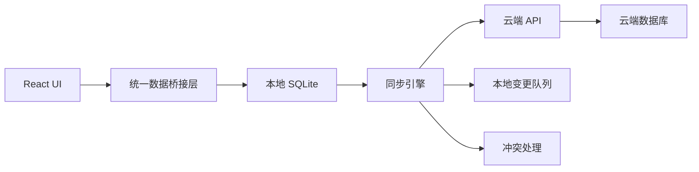
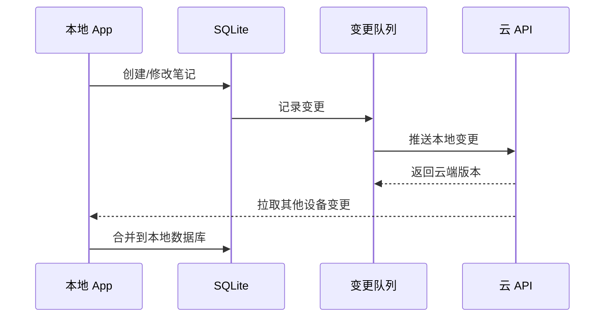

# Kova 本地版 / 云同步版规划

## 核心定位

- 本地版不是阉割版：离线、隐私、速度、数据自主管理继续作为默认体验。
- 云版本不是另一个 App：它只是同一个 App 的“登录后增强模式”。
- 第一阶段云能力只解决：多设备同步、云备份、设备恢复。
- 暂不做团队协作、实时多人编辑、公开分享、订阅计费，避免过早把复杂度拉满。

## 当前项目基础

现有边界适合做本地优先同步：

- 前端统一通过桥接层访问数据：[d:\study\kova\src\lib\db.ts](d:\study\kova\src\lib\db.ts)
- 核心数据模型已经集中在：[d:\study\kova\src-tauri\src\services\models.rs](d:\study\kova\src-tauri\src\services\models.rs)
- 本地 SQLite 初始化和迁移集中在：[d:\study\kova\src-tauri\src\services\db\mod.rs](d:\study\kova\src-tauri\src\services\db\mod.rs)

这意味着云同步应该加在“本地数据库之后、前端业务之前”的同步层，而不是让前端直接依赖云 API。

## 推荐架构



## 版本形态

### 本地模式

- 无账号也能完整使用。
- 数据只保存在本地 SQLite。
- 支持手动备份、恢复、导入导出。
- AI 配置继续保存在本地，API Key 不上传。

### 云同步模式

- 用户登录后开启。
- 每台设备仍然读写本地 SQLite。
- 本地变更写入变更队列，后台同步到云端。
- 云端数据再同步回其他设备。
- 断网时继续可用，联网后补偿同步。

## 数据模型演进

第一阶段只同步这些对象：

- `notes`
- `folders`
- 附件元数据和附件文件
- 用户设置中“适合同步”的部分，例如主题、字体、布局偏好

暂不同步：

- AI API Key
- 本地数据目录路径
- 窗口尺寸、设备相关配置
- 可能包含隐私风险的本机路径

建议新增通用同步字段：

```text
sync_status: pending | synced | conflict | deleted
sync_version: number
cloud_id: string | null
deleted_at: string | null
last_synced_at: string | null
device_id: string
```

其中 `id` 继续保留本地 UUID，`cloud_id` 用于云端对象关联。这样可以避免未来迁移时破坏本地数据。

## 同步策略

### 第一阶段：非实时同步

采用“变更队列 + 定时推送 + 拉取增量”的方式。



优点：

- 实现成本低。
- 离线体验稳定。
- 不需要一开始做 WebSocket 或实时协作。
- 更符合笔记应用的使用节奏。

### 冲突处理

第一版建议简单明确：

- 不同字段可自动合并：标题、标签、文件夹位置、更新时间。
- 正文冲突不自动覆盖。
- 如果两台设备同时修改正文，保留两个版本：
  - 当前版本
  - 冲突副本
- UI 中提示用户手动处理。

不要第一版就做复杂 CRDT。Kova 当前不是实时协作文档，CRDT 成本太高。

## 云端模块规划

建议新建独立云服务，而不是把云逻辑塞进 Tauri 后端。

云端最小模块：

```text
auth        账号、登录、设备授权
sync        增量同步、版本判断、冲突标记
storage     附件上传、下载、对象存储
backup      云备份快照
billing     后续预留，第一阶段不做
admin       后续预留，第一阶段不做
```

推荐云端技术可以务实选择：

- API：Node.js / Rust / Go 均可
- 数据库：PostgreSQL
- 附件：S3 兼容对象存储
- 鉴权：邮箱验证码 / OAuth / passkey 后续再加
- 部署：Docker + PostgreSQL + 对象存储

## 前端产品入口

设置面板中增加“同步”页：

```text
同步状态
- 当前模式：本地 / 云同步
- 登录账号
- 当前设备名
- 最近同步时间
- 同步中 / 已同步 / 有冲突 / 同步失败

操作
- 登录 / 退出登录
- 立即同步
- 查看冲突
- 从云端恢复
- 关闭云同步
```

侧边栏或标题栏只显示轻量状态，不要干扰编辑体验。

## 实施阶段

### Phase 1：本地同步基础改造

目标：让当前本地数据具备可同步能力，但不接云。

- 给核心表补充同步字段。
- 增加本地变更日志表。
- 所有创建、修改、删除操作都记录变更。
- 删除从硬删除逐步改成软删除。
- 增加本地 `device_id`。

### Phase 2：云账号与设备体系

目标：让用户能登录并绑定当前设备。

- 增加账号服务。
- 增加设备注册。
- App 保存登录态。
- 设置页展示账号和设备状态。

### Phase 3：笔记与文件夹增量同步

目标：支持多设备同步核心笔记数据。

- 上传本地变更。
- 拉取云端增量。
- 处理删除、移动、重命名。
- 增加冲突副本策略。
- 提供“立即同步”和后台自动同步。

### Phase 4：附件与云备份

目标：补齐实际使用闭环。

- 附件上传对象存储。
- 附件下载与本地缓存。
- 手动云备份。
- 新设备从云端恢复。

### Phase 5：商业化和协作预留

目标：只预留边界，不立即实现。

- 云容量限制。
- 多设备数量限制。
- 分享链接。
- 团队空间。
- 订阅计费。

## 关键取舍

- 不建议一开始拆成本地版和云版两个代码库。
- 不建议云模式绕过本地 SQLite 直接读写云端。
- 不建议第一版做实时多人协作。
- 不建议上传用户 AI API Key。
- 建议先把“本地数据可同步化”做好，再接云服务。

## 最小可上线版本

MVP 范围建议是：

- 一个账号登录。
- 多设备同步 `notes` 和 `folders`。
- 软删除。
- 手动同步 + 自动定时同步。
- 冲突生成副本。
- 云端整库备份。
- 附件可以第二小版本再做。

这个版本已经能形成清晰卖点：本地优先、可离线、多设备同步、数据可恢复。