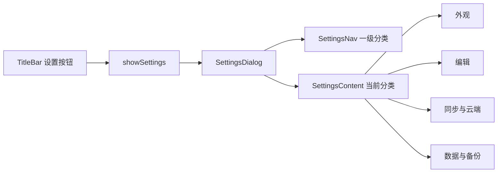

# 设置弹窗化与分类重组

## 目标
- 把设置从“主布局里的可拉伸侧栏”改为“独立弹窗”。
- 把当前长列表改为“一级设置类型 + 二级分组内容”。
- 尽量不动现有设置值的存取方式，先重构容器和信息架构，再做内容迁移。

## 现状判断
- 主界面当前把设置作为右侧面板挂在主布局里，和 AI 面板并列，宽度由 `usePanelResize` 控制，落点在 [D:\study\kova\src\App.tsx](D:\study\kova\src\App.tsx)。
- 设置按钮只是在标题栏里开关这个侧栏，落点在 [D:\study\kova\src\components\layout\TitleBar.tsx](D:\study\kova\src\components\layout\TitleBar.tsx)。
- 设置内容本体已经承载了外观、编辑器、窗口、便签、快捷键、数据目录、同步诊断、云端设备、备份恢复等多类能力，全部堆在同一滚动列里，落点在 [D:\study\kova\src\components\layout\SettingsPanel\index.tsx](D:\study\kova\src\components\layout\SettingsPanel\index.tsx)。

## 建议的信息架构

### 一级分类
- 常规
- 外观
- 编辑
- 快捷便签
- 同步与云端
- 数据与备份
- 关于

### 二级分组
- 常规
  - 启动与托盘
  - 窗口行为
- 外观
  - 主题
  - 字体
  - 阅读密度
- 编辑
  - 自动保存
  - 缩进与视图
- 快捷便签
  - 默认行为
  - 全局快捷键
- 同步与云端
  - 同步策略
  - 同步诊断
  - 云端设备
- 数据与备份
  - 数据目录
  - 本地备份恢复
  - 云备份恢复
  - 本地清理
- 关于
  - 版本信息
  - 后续可放更新入口、日志入口

## 推荐交互形态
- 设置按钮点击后，打开居中弹窗，不再挤压主编辑区宽度。
- 弹窗内部采用三段式结构
  - 顶部：标题、搜索入口预留、关闭按钮
  - 左侧：一级分类导航
  - 右侧：当前分类内容区，内部再按二级分组展示
- 弹窗尺寸建议
  - 默认宽度 880 到 980
  - 默认高度 640 到 720
  - 内容区独立滚动
- 分类切换策略
  - 左侧点击切分类
  - 右侧滚动不影响左侧导航
  - 后续可支持记忆上次停留分类

## 推荐模块拆分
- 保留现有设置读写逻辑在 [D:\study\kova\src\components\layout\SettingsPanel\index.tsx](D:\study\kova\src\components\layout\SettingsPanel\index.tsx) 里先做过渡，但 UI 容器建议拆出去。
- 新结构建议
  - `SettingsDialog`：弹窗外壳、遮罩、关闭逻辑
  - `SettingsNav`：左侧分类导航
  - `SettingsSection`：右侧分类页容器
  - `settings-schema.ts`：分类定义、标题、描述、顺序
  - 逐步把现有设置项切成若干分组块，例如 `AppearanceSettings`、`EditorSettings`、`SyncSettings`
- `ui-rows.tsx` 可以继续复用，说明现有“单项设置控件”基本不用重写，主要重构的是“装配层”。

## 建议迁移映射
- 当前“通用 + 窗口”合并进“常规”
- 当前“外观”独立成为“外观”
- 当前“编辑器”独立成为“编辑”
- 当前“便签 + 快捷键”合并成“快捷便签”
- 当前“同步诊断 + 云端设备”合并成“同步与云端”
- 当前“数据存储 + 备份与恢复”合并成“数据与备份”
- 当前底部版本信息迁移到“关于”

## 状态与边界调整
- `showSettings` 保留，但语义从“展开侧栏”变成“打开弹窗”。
- 删除设置面板宽度拖拽依赖，不再需要 `kova-settings-width` 这类侧栏尺寸状态。
- 设置弹窗应与 AI 面板解耦
  - 现在是“打开设置时关闭 AI，打开 AI 时关闭设置”
  - 改造后建议保留互斥，避免两个重型面板同时出现
- 恢复确认框 `ConfirmDialog` 仍可保留为设置弹窗内部触发的二级确认层。

## 最小可落地路径
1. 先把现有 `SettingsPanel` 从侧栏容器改成弹窗容器，不调整设置项内容。
2. 再引入左侧一级分类导航，把原长列表分段挂到对应分类页。
3. 最后把每个分类里的内容继续细分为可复用分组块，整理命名与顺序。

## 风险点
- 当前设置页里有不少“立即生效”的行为，弹窗化后仍要保证关闭前不丢状态。
- 云备份、恢复、设备管理这类操作较重，分类切换时不能让中间状态丢失。
- 现有恢复确认、消息提示都内聚在同一个组件里，拆分时要注意状态归属不要散掉。

## 关键文件
- [D:\study\kova\src\App.tsx](D:\study\kova\src\App.tsx)
- [D:\study\kova\src\components\layout\TitleBar.tsx](D:\study\kova\src\components\layout\TitleBar.tsx)
- [D:\study\kova\src\components\layout\SettingsPanel\index.tsx](D:\study\kova\src\components\layout\SettingsPanel\index.tsx)
- [D:\study\kova\src\components\layout\SettingsPanel\ui-rows.tsx](D:\study\kova\src\components\layout\SettingsPanel\ui-rows.tsx)

## 参考片段
当前设置页是侧栏形态，后续这里会改成弹窗壳，而不是主布局右侧伸缩区：

```539:547:D:\study\kova\src\components\layout\SettingsPanel\index.tsx
  return (
    <aside className="w-full h-full shrink-0 border-l-2 border-paper-deep/60 bg-paper/92 backdrop-blur-sm flex flex-col min-w-[260px]">
      <div className="flex items-center justify-between h-11 px-4 border-b border-paper-deep/25 shrink-0">
        <h2 className="text-[13px] font-medium text-ink-soft">应用设置</h2>
        <button type="button" onClick={onClose}
          className="w-7 h-7 flex items-center justify-center rounded-lg text-ink-ghost hover:text-ink-soft hover:bg-paper-warm transition-colors" title="关闭设置">
```

主布局当前把设置当作右侧伸缩面板接入，后续这一段要替换成弹窗挂载：

```693:715:D:\study\kova\src\App.tsx
        {/* Settings panel */}
        <div className="relative shrink-0 flex overflow-hidden" style={{ width: showSettings && !showAI ? settings.width : 0, transition: isDragging ? "none" : "width 0.5s cubic-bezier(0.22,1,0.36,1)" }}>
          <div className="w-1 shrink-0 bg-paper-deep/30 cursor-col-resize hover:bg-accent/40 transition-colors" onMouseDown={settings.handleMouseDown} />
          <div className="h-full shrink-0 overflow-hidden" style={{ width: settings.width - 4 }}>
            <SettingsPanel
              onClose={() => setShowSettings(false)}
              mode={mode}
              onImported={() => { fetch(undefined, selectedFolderId ?? undefined); db.list().then((all: Note[]) => setAllNotes(all)); }}
```

建议未来的弹窗骨架可以按下面的关系实现：


